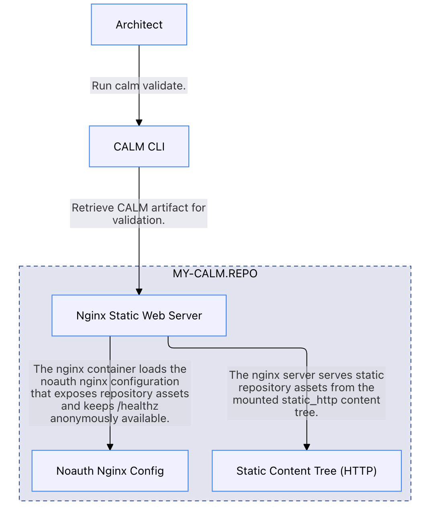
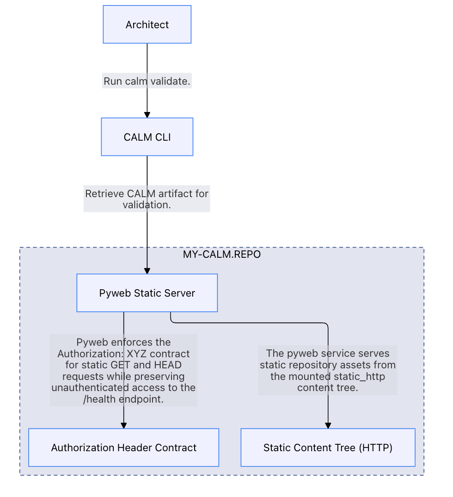
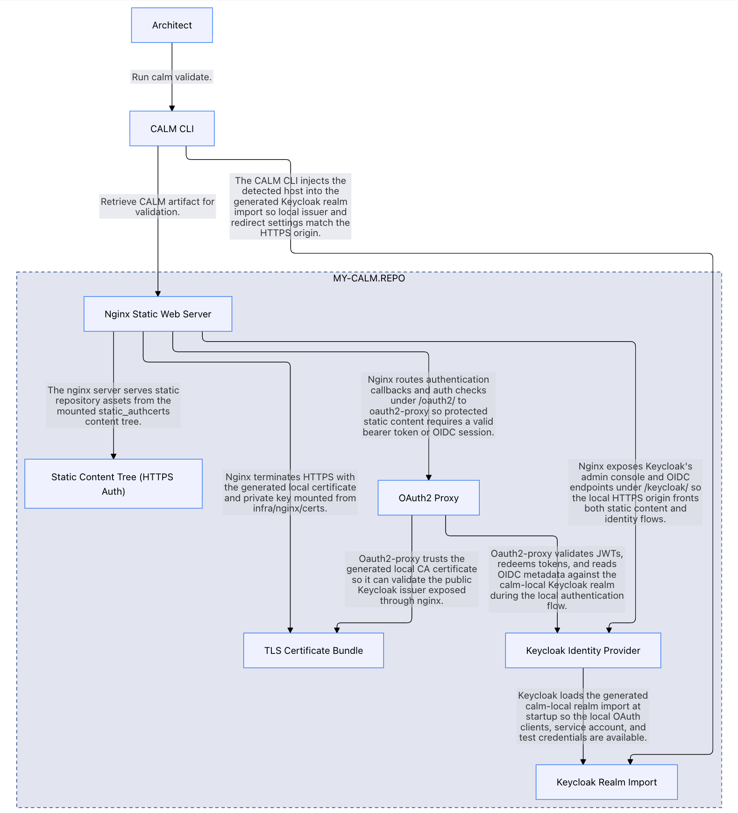
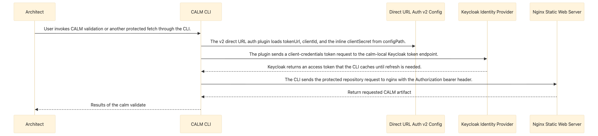
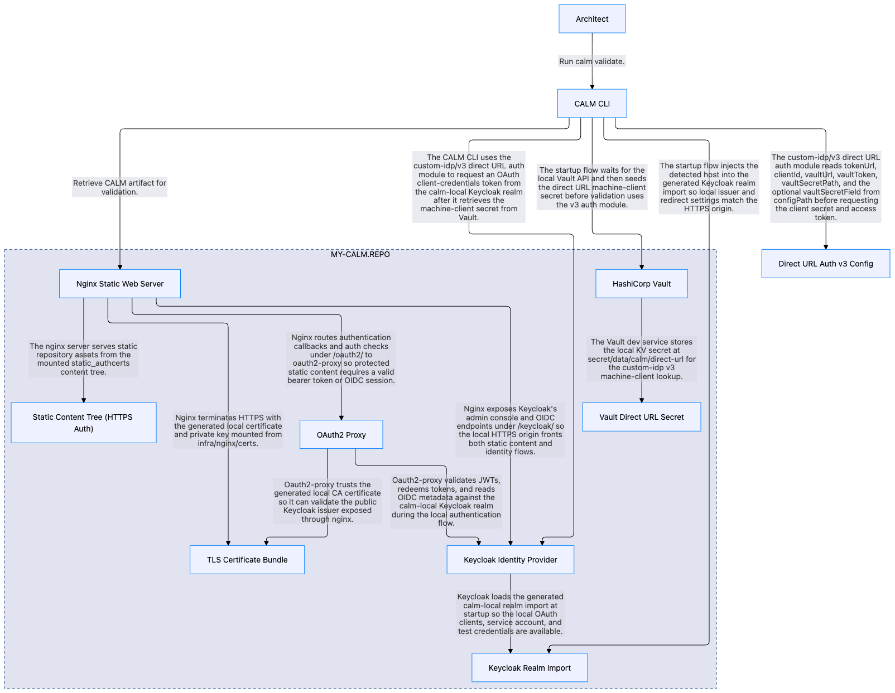
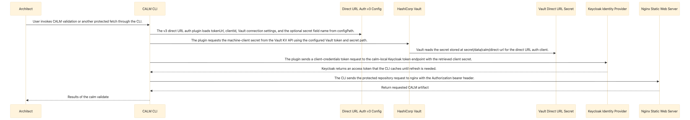

# CALM Artifact Access Testbed

Repository for serving FINOS CALM JSON content with Nginx, plus Python and TypeScript application scaffolds for future API and UI work. Local development supports both authenticated HTTPS backed by Keycloak and a noauth HTTP mode for static-only serving, with an anonymous health check for operational use.

Protected repository content in the auth-enabled modes is bearer-token-only for normal access. The supported local automation path is CALM CLI direct URL loading with the `custom-idp/v2` client-credentials module against the bundled Keycloak realm. A second local example, `custom-idp/v3`, shows the same OAuth flow with the client secret retrieved from HashiCorp Vault.

The local `calm-direct-url` machine client uses a Keycloak service-account token. The web stack is configured to accept that bearer token directly for protected static content.


## Testbed for CALM DirectUrlDocumentLoader Authentication

For local testing purposes, after building the `calm cli` with support for the `directUrlAuth` plugin, run from the `architecture-as-code` root directory `npm run link:cli`.

The `make` startup targets do more than launch the local web stack variants. They also keep `~/.calm.json` aligned with the active test setup by repointing that symlink to the scenario-specific CALM CLI config before each stack starts. See [Setup test configuration specific `.calm.json` files](#setup-test-configuration-specific-calmjson-files) for details.

### `start-webserver-noauth`  (Baseline No Authentication)
`start-webserver-noauth` models the simplest local serving path: an nginx container exposes the `static_http/` content tree over plain HTTP on port `8080`, i.e., `http://my-calm.repo:8080`. This architecture excludes `oauth2-proxy` and Keycloak, and keeps the health endpoint anonymously available for basic checks.

**To test run following bash script**:

```
./scripts/validate-architecture.sh
```

[CALM Architecture JSON](docs/architecture/start-webserver-noauth.architecture.json)



**Contents of `~/.calm.json`**:
```json
{
  "allowedRemoteHosts":[
    "my-calm.repo"
  ]
}
```

### `start-webserver-authonly` (Simple hard-coded authentication in Header)
`start-webserver-authonly` models the lightweight protected local mode built around the Compose-managed Python `pyweb` server. It serves the same `static_http/` content tree over `http://my-calm.repo:8080`, requires `Authorization: XYZ` for static content requests, and leaves `/health` accessible without that header.

**To test run following bash script**:

```
./scripts/validate-architecture.sh
```

[CALM Architecture JSON](docs/architecture/start-webserver-authonly.architecture.json)



**Source Code for Direct URL Auth Plugin**: [v1/src/direct-url-auth.ts](custom-idp/v1/src/direct-url-auth.ts)

**Contents of `~/.calm.json`**:

```json
{
  "allowedRemoteHosts":[
    "my-calm.repo"
  ],
  "directUrlAuth": {
    "module": "/Users/jim/Desktop/finos/calm-web-repo/custom-idp/v1/dist/direct-url-auth.js",
    "configPath": "/Users/jim/Desktop/finos/calm-web-repo/custom-idp/v1/config/direct-url-auth.json"
  }
}
```

**Contents of `.../config/direct-url-auth.json`**:
```json
{

  "fakeToken": "XYZ"
}

```

### `start-webserver-authcerts` (Oauth2 client-credential authentication)
`start-webserver-authcerts` models the full local authenticated HTTPS stack. Nginx fronts the `static_authcerts/` content tree on port `8443`, uses generated TLS assets, delegates protected-content checks to `oauth2-proxy`, and exposes the bundled Keycloak realm that supports bearer-token and OIDC-backed access.

**To test run following bash script**:

```
# To use private self-signed certs
# export NODE_EXTRA_CA_CERTS=custom-idp/v2/certs/localhost.crt
#
# or 
#
# To disable certificate validation
# export NODE_TLS_REJECT_UNAUTHORIZED=0

./scripts/validate-architecture.sh https://my-calm.repo:8443
```

[CALM Architecture JSON](docs/architecture/start-webserver-authcerts.architecture.json)





**Source Code For Direct URL Auth Plugin**: [v2/src/direct-url-auth.ts](custom-idp/v2/src/direct-url-auth.ts)

**Contents of `~/.calm.json`***:

```json
{
  "allowedRemoteHosts":[
    "my-calm.repo",
    "your-calm.repo"
  ],
  "directUrlAuth": {
    "module": "~/Desktop/finos/calm-web-repo/custom-idp/v2/dist/direct-url-auth.js",
    "configPath": "~/Desktop/finos/calm-web-repo/custom-idp/v2/generated/direct-url-auth.json"
  }
}
```

**Contents of `.../generated/direct-url-auth.json`**:
```json
{
  "tokenUrl": "https://my-calm.repo:8443/keycloak/realms/calm-local/protocol/openid-connect/token",
  "clientId": "calm-direct-url",
  "clientSecret": <local secret>
}

```

The startup flow also copies the generated `infra/nginx/certs/localhost.crt` file into `custom-idp/v2/certs/localhost.crt`.

### `start-webserver-vaulting` (Oauth2 client-credential authentication with Vault)
`start-webserver-vaulting` builds on the same HTTPS Keycloak stack as `start-webserver-authcerts`, but seeds the local Keycloak machine-client secret into a HashiCorp Vault dev server and generates a `custom-idp/v3` config that reads the secret from Vault.

**To test run following bash script**:

```
# To use private self-signed certs
# export NODE_EXTRA_CA_CERTS=custom-idp/v3/certs/localhost.crt
#
# or 
#
# To disable certificate validation
# export NODE_TLS_REJECT_UNAUTHORIZED=0

./scripts/validate-architecture.sh https://my-calm.repo:8443
```

[CALM Architecture JSON](docs/architecture/start-webserver-vaulting.architecture.json)





**Source Code For Direct URL Auth Plugin**: [v3/src/direct-url-auth.ts](custom-idp/v3/src/direct-url-auth.ts)

**Contents of `~/.calm.json`***:

```json
{
  "allowedRemoteHosts":[
    "my-calm.repo",
    "your-calm.repo"
  ],
  "directUrlAuth": {
    "module": "~/Desktop/finos/calm-web-repo/custom-idp/v3/dist/direct-url-auth.js",
    "configPath": "~/Desktop/finos/calm-web-repo/custom-idp/v3/generated/direct-url-auth.json"
  }
}
```

**Contents of `.../generated/direct-url-auth.json`**:
```json
{
  "tokenUrl": "https://my-calm.repo:8443/keycloak/realms/calm-local/protocol/openid-connect/token",
  "clientId": "calm-direct-url",
  "vaultUrl": "http://127.0.0.1:8200",
  "vaultToken": "calm-local-vault-root-token",
  "vaultSecretPath": "secret/data/calm/direct-url",
  "vaultSecretField": "clientSecret"
}

```

The startup flow also copies the generated `infra/nginx/certs/localhost.crt` file into `custom-idp/v3/certs/localhost.crt`.

### `start-webserver-mixed` (Vault-backed HTTPS and unauthenticated HTTP)

`start-webserver-mixed` runs `start-webserver-vaulting`, then starts a second nginx service named `nginx-noauth`. Both endpoints are available together:

- `https://<host>:8443` serves `static_authcerts/` with bearer-token authentication.
- `http://<host>:8080` serves `static_http/` without authentication, including `/architectures/calm-1.json` and the anonymous `/healthz` endpoint.

The HTTP service mounts `static_http/` read-only at `/usr/share/nginx/html` and reuses the existing noauth nginx configuration. Its mounts and port are fixed independently of the authenticated nginx service's environment overrides.

Mixed mode inherits the Vault setup, generated v3 auth configuration and certificates, and `~/.calm.json` symlink to `~/.calmvaulting.json`. Use the same prerequisites and HTTPS client setup as vaulting mode.

Stop an existing mode before switching to avoid port conflicts, particularly on `8080`:

```sh
make stop-webserver
make start-webserver-mixed
```

Use `make stop-webserver` to stop both nginx services and the rest of the stack.

## Negative test cases

Given the setup with `make start-webserver-authcerts`, here are example of negative tests.  The output shown are the trimmed down `--verbose`

### Support for self-signed certs not setup.
```
$ calm validate -a https://my-calm.repo:8443/architectures/calm-1.json -f pretty -v
(node:65855) [DEP0040] DeprecationWarning: The `punycode` module is deprecated. Please use a userland alternative instead.
(Use `node --trace-deprecation ...` to show where the warning was created)
info [calm-cli]:     Loading direct URL auth module from config file: ~/Desktop/finos/calm-web-repo/custom-idp/v2/dist/direct-url-auth.js
info [calm-cli]:     Direct URL auth configPath: ~/Desktop/finos/calm-web-repo/custom-idp/v2/generated/direct-url-auth.json
info [direct URL auth module]:     🔍 Loading direct URL auth module: /Users/jim/Desktop/finos/calm-web-repo/custom-idp/v2/dist/direct-url-auth.js
debug [calm-cli]:    Direct URL auth module loaded successfully
info [calm-cli]:     Using allowed remote hosts from config file
debug [multi-strategy-document-loader]:    Initialising MultiStrategyDocumentLoader with loaders: FileSystemDocumentLoader, DirectUrlDocumentLoader

<<<<<<<<<<<<<<<<<REMOVED EXTRANEOUS DEBUG MESSAGES>>>>>>>>>>>>>>>>>

debug [multi-strategy-document-loader]:    Document Loader Report:
Loader FileSystemDocumentLoader FAILED with error: Document with id [https://my-calm.repo:8443/architectures/calm-1.json] and type [architecture] was requested but not loaded at initialisation. 
            File system document loader can only load at startup. Please ensure the schemas are present on your directory path or use CALMHub.
Loader DirectUrlDocumentLoader FAILED with error: Direct URL authentication failed for https://my-calm.repo:8443/architectures/calm-1.json. Check direct URL auth configuration and remote credentials.

error [calm-validate]:    An error occurred while validating: Direct URL authentication failed for https://my-calm.repo:8443/architectures/calm-1.json. Check direct URL auth configuration and remote credentials.
error [calm-validate]:    Cause: Direct URL auth token request to https://my-calm.repo:8443/keycloak/realms/calm-local/protocol/openid-connect/token failed: self-signed certificate
debug [calm-validate]:    AUTHENTICATION_FAILED: Direct URL authentication failed for https://my-calm.repo:8443/architectures/calm-1.json. Check direct URL auth configuration and remote credentials.
    at DirectUrlDocumentLoader.loadMissingDocument (/Users/jim/Desktop/finos/wt/iss2975-idp-directurl/cli/dist/index.js:94164:21)
    at processTicksAndRejections (node:internal/process/task_queues:103:5)
    at MultiStrategyDocumentLoader.loadMissingDocument (/Users/jim/Desktop/finos/wt/iss2975-idp-directurl/cli/dist/index.js:94236:20)
    at loadArchitecture (/Users/jim/Desktop/finos/wt/iss2975-idp-directurl/cli/dist/index.js:115327:16)
    at loadArchitectureAndPattern (/Users/jim/Desktop/finos/wt/iss2975-idp-directurl/cli/dist/index.js:115266:24)
    at runValidate (/Users/jim/Desktop/finos/wt/iss2975-idp-directurl/cli/dist/index.js:119095:22)
    at Command.<anonymous> (/Users/jim/Desktop/finos/wt/iss2975-idp-directurl/cli/dist/index.js:119609:5)
    at Command.parseAsync (/Users/jim/Desktop/finos/wt/iss2975-idp-directurl/node_modules/commander/lib/command.js:1122:5)
```


### Before executing the following `calm validate` commands, this environment variable was set up: `export NODE_EXTRA_CA_CERTS=custom-idp/v2/certs/localhost.crt`

### Invalid host name
```
$ calm validate -a https://your-calm.repo:8443/architectures/calm-1.json -f pretty -v

(node:53126) [DEP0040] DeprecationWarning: The `punycode` module is deprecated. Please use a userland alternative instead.
(Use `node --trace-deprecation ...` to show where the warning was created)
info [calm-cli]:     Loading direct URL auth module from config file: ~/Desktop/finos/calm-web-repo/custom-idp/v2/dist/direct-url-auth.js
info [calm-cli]:     Direct URL auth configPath: ~/Desktop/finos/calm-web-repo/custom-idp/v2/generated/direct-url-auth.json
info [direct URL auth module]:     🔍 Loading direct URL auth module: /Users/jim/Desktop/finos/calm-web-repo/custom-idp/v2/dist/direct-url-auth.js
debug [calm-cli]:    Direct URL auth module loaded successfully
info [calm-cli]:     Using allowed remote hosts from config file

<<<<<<<<<<<<<<<<<REMOVED EXTRANEOUS DEBUG MESSAGES>>>>>>>>>>>>>>>>>

debug [file-system-document-loader]:    Document with id [https://your-calm.repo:8443/architectures/calm-1.json] and type [architecture] was requested but not loaded at initialisation. 
            File system document loader can only load at startup. Please ensure the schemas are present on your directory path or use CALMHub.
debug [direct-url-document-loader]:    Starting Request: {
  "method": "get",
  "url": "https://your-calm.repo:8443/architectures/calm-1.json",
  "baseURL": "https://your-calm.repo:8443",
  "path": "/architectures/calm-1.json",
  "timeout": 10000,
  "maxRedirects": 0,
  "allowAbsoluteUrls": false,
  "headers": {
    "Accept": "application/json, text/plain, */*",
    "Content-Type": "application/json"
  },
  "authHeadersPresent": true,
  "authHeaderNames": [
    "Authorization"
  ]
}
error [multi-strategy-document-loader]:    Loader DirectUrlDocumentLoader failed fatally loading document: https://your-calm.repo:8443/architectures/calm-1.json. Enable debug logging for the full loader report.
debug [multi-strategy-document-loader]:    Document Loader Report:
Loader FileSystemDocumentLoader FAILED with error: Document with id [https://your-calm.repo:8443/architectures/calm-1.json] and type [architecture] was requested but not loaded at initialisation. 
            File system document loader can only load at startup. Please ensure the schemas are present on your directory path or use CALMHub.
Loader DirectUrlDocumentLoader FAILED with error: Failed to load document from URL: https://your-calm.repo:8443/architectures/calm-1.json

error [calm-validate]:    An error occurred while validating: Failed to load document from URL: https://your-calm.repo:8443/architectures/calm-1.json
error [calm-validate]:    Cause: Hostname/IP does not match certificate's altnames: Host: your-calm.repo. is not in the cert's altnames: DNS:localhost, DNS:host.docker.internal, IP Address:127.0.0.1, DNS:my-calm.repo
error [calm-validate]:    Caused by: Hostname/IP does not match certificate's altnames: Host: your-calm.repo. is not in the cert's altnames: DNS:localhost, DNS:host.docker.internal, IP Address:127.0.0.1, DNS:my-calm.repo
debug [calm-validate]:    UNKNOWN: Failed to load document from URL: https://your-calm.repo:8443/architectures/calm-1.json
    at DirectUrlDocumentLoader.loadMissingDocument (/Users/jim/Desktop/finos/wt/iss2975-idp-directurl/cli/dist/index.js:94194:17)
    at processTicksAndRejections (node:internal/process/task_queues:103:5)
    at MultiStrategyDocumentLoader.loadMissingDocument (/Users/jim/Desktop/finos/wt/iss2975-idp-directurl/cli/dist/index.js:94236:20)
    at loadArchitecture (/Users/jim/Desktop/finos/wt/iss2975-idp-directurl/cli/dist/index.js:115327:16)
    at loadArchitectureAndPattern (/Users/jim/Desktop/finos/wt/iss2975-idp-directurl/cli/dist/index.js:115266:24)
    at runValidate (/Users/jim/Desktop/finos/wt/iss2975-idp-directurl/cli/dist/index.js:119095:22)
    at Command.<anonymous> (/Users/jim/Desktop/finos/wt/iss2975-idp-directurl/cli/dist/index.js:119609:5)
    at Command.parseAsync (/Users/jim/Desktop/finos/wt/iss2975-idp-directurl/node_modules/commander/lib/command.js:1122:5)
```

### `directUrlAuth.configPath` contains invalid `clientID`
```
$ calm validate -a https://my-calm.repo:8443/architectures/calm-1.json -f pretty -v
(node:62378) [DEP0040] DeprecationWarning: The `punycode` module is deprecated. Please use a userland alternative instead.
(Use `node --trace-deprecation ...` to show where the warning was created)
info [calm-cli]:     Loading direct URL auth module from config file: ~/Desktop/finos/calm-web-repo/custom-idp/v2/dist/direct-url-auth.js
info [calm-cli]:     Direct URL auth configPath: ~/Desktop/finos/calm-web-repo/custom-idp/v2/generated/direct-url-auth.json
info [direct URL auth module]:     🔍 Loading direct URL auth module: /Users/jim/Desktop/finos/calm-web-repo/custom-idp/v2/dist/direct-url-auth.js
debug [calm-cli]:    Direct URL auth module loaded successfully
info [calm-cli]:     Using allowed remote hosts from config file
debug [multi-strategy-document-loader]:    Initialising MultiStrategyDocumentLoader with loaders: FileSystemDocumentLoader, DirectUrlDocumentLoader

<<<<<<<<<<<<<<<<<REMOVED EXTRANEOUS DEBUG MESSAGES>>>>>>>>>>>>>>>>>

debug [multi-strategy-document-loader]:    Document Loader Report:
Loader FileSystemDocumentLoader FAILED with error: Document with id [https://my-calm.repo:8443/architectures/calm-1.json] and type [architecture] was requested but not loaded at initialisation. 
            File system document loader can only load at startup. Please ensure the schemas are present on your directory path or use CALMHub.
Loader DirectUrlDocumentLoader FAILED with error: Direct URL authentication failed for https://my-calm.repo:8443/architectures/calm-1.json. Check direct URL auth configuration and remote credentials.

error [calm-validate]:    An error occurred while validating: Direct URL authentication failed for https://my-calm.repo:8443/architectures/calm-1.json. Check direct URL auth configuration and remote credentials.
error [calm-validate]:    Cause: Direct URL auth token request to https://my-calm.repo:8443/keycloak/realms/calm-local/protocol/openid-connect/token failed: 401 Unauthorized
debug [calm-validate]:    AUTHENTICATION_FAILED: Direct URL authentication failed for https://my-calm.repo:8443/architectures/calm-1.json. Check direct URL auth configuration and remote credentials.
    at DirectUrlDocumentLoader.loadMissingDocument (/Users/jim/Desktop/finos/wt/iss2975-idp-directurl/cli/dist/index.js:94164:21)
    at processTicksAndRejections (node:internal/process/task_queues:103:5)
    at MultiStrategyDocumentLoader.loadMissingDocument (/Users/jim/Desktop/finos/wt/iss2975-idp-directurl/cli/dist/index.js:94236:20)
    at loadArchitecture (/Users/jim/Desktop/finos/wt/iss2975-idp-directurl/cli/dist/index.js:115327:16)
    at loadArchitectureAndPattern (/Users/jim/Desktop/finos/wt/iss2975-idp-directurl/cli/dist/index.js:115266:24)
    at runValidate (/Users/jim/Desktop/finos/wt/iss2975-idp-directurl/cli/dist/index.js:119095:22)
    at Command.<anonymous> (/Users/jim/Desktop/finos/wt/iss2975-idp-directurl/cli/dist/index.js:119609:5)
    at Command.parseAsync (/Users/jim/Desktop/finos/wt/iss2975-idp-directurl/node_modules/commander/lib/command.js:1122:5)
Mac:jim calm-web-repo[507]$ 
```


## Prerequisites

- Docker and `docker-compose`
- Python 3.12+
- `uv`
- Node.js (LTS recommended)
- npm
- A local hosts-file entry, e.g., in `/etc/hosts` on MacOS, such as `127.0.0.1 my-calm.repo`

## Setup test configuration specific `.calm.json` files

Do not create `~/.calm.json` as a regular file. The Makefile manages it as a symlink.

### Template: `~/.calmnoauth.json`

Use this file for `make start-webserver-noauth`.

```json
{
  "allowedRemoteHosts": ["my-calm.repo"]
}
```

Notes:

- This mode serves content over plain HTTP from the nginx-only stack.
- No direct URL auth module is required.

## Template: `~/.calmauthonly.json`

Use this file for `make start-webserver-authonly`.

```json
{
  "allowedRemoteHosts": ["my-calm.repo"],
  "directUrlAuth": {
    "module": "/ABSOLUTE/PATH/TO/calm-web-repo/custom-idp/v1/dist/direct-url-auth.js",
    "configPath": "/ABSOLUTE/PATH/TO/calm-web-repo/custom-idp/v1/config/direct-url-auth.json"
  }
}
```

### Build directUrlAuth Plugin for authonly

Build the `v1` module:

```bash
cd custom-idp/v1
npm install
npm run build
```

Notes:

- This mode serves content from `apps/pyweb` on `http://my-calm.repo:8080`.
- This mirrors the cert-based template structure, but points to the checked-in `custom-idp/v1` example instead of the `v2` Keycloak client-credentials module.
- The `directUrlAuth.module` value must point to the built JavaScript output, not the TypeScript source.
- The `directUrlAuth.configPath` value points to the checked-in `custom-idp/v1/config/direct-url-auth.json` example config.

## Template: `~/.calmauthcerts.json`

Use this file for `make start-webserver-authcerts`.

```json
{
  "allowedRemoteHosts": ["my-calm.repo", "localhost"],
  "directUrlAuth": {
    "module": "/ABSOLUTE/PATH/TO/calm-web-repo/custom-idp/v2/dist/direct-url-auth.js",
    "configPath": "/ABSOLUTE/PATH/TO/calm-web-repo/custom-idp/v2/generated/direct-url-auth.json"
  }
}
```

### Build directUrlAuth Plugin for authcerts

Build the `v2` module:

```bash
cd custom-idp/v2
npm install
npm run build
```


Notes:

- This mode serves protected content through HTTPS on `https://my-calm.repo:8443`.
- The `directUrlAuth.module` value must point to the built JavaScript output, not the TypeScript source.
- The `directUrlAuth.configPath` value must point to the generated JSON written by `./scripts/render-direct-url-auth-config.py`.
- The startup flow copies `infra/nginx/certs/localhost.crt` into `custom-idp/v2/certs/localhost.crt`.

## Template: `~/.calmvaulting.json`

Use this file for `make start-webserver-vaulting`.

```json
{
  "allowedRemoteHosts": ["my-calm.repo", "localhost"],
  "directUrlAuth": {
    "module": "/ABSOLUTE/PATH/TO/calm-web-repo/custom-idp/v3/dist/direct-url-auth.js",
    "configPath": "/ABSOLUTE/PATH/TO/calm-web-repo/custom-idp/v3/generated/direct-url-auth.json"
  }
}
```

### Build directUrlAuth Plugin for vaulting

Build the `v3` module:

```bash
cd custom-idp/v3
npm install
npm run build
```

Notes:

- This mode serves protected content through HTTPS on `https://my-calm.repo:8443`.
- It uses the same Keycloak and `oauth2-proxy` stack as `start-webserver-authcerts`.
- The `directUrlAuth.module` value must point to the built JavaScript output, not the TypeScript source.
- The `directUrlAuth.configPath` value must point to the generated JSON written by `./scripts/render-direct-url-auth-vault-config.py`.
- The startup flow copies `infra/nginx/certs/localhost.crt` into `custom-idp/v3/certs/localhost.crt`.


## Commands

- `make start-webserver-noauth` mounts `static_http/` directly into `nginx` and starts it on `http://<host>:8080`.
- `make start-webserver-authonly` repoints `~/.calm.json` to `~/.calmauthonly.json`, mounts `static_http/` directly into the `apps/pyweb` container, and starts it through Docker Compose on `http://my-calm.repo:8080`.
- `make start-webserver-authcerts` generates local TLS/auth assets, mounts `static_authcerts/` directly into `nginx`, and starts the full auth stack in detached mode.
- `make start-webserver-vaulting` reuses the authcerts HTTPS stack, starts a local Vault dev server, seeds the machine-client secret, and generates the `custom-idp/v3` config.
- `make start-webserver-mixed` starts the Vault-backed HTTPS stack on `https://<host>:8443` and an independent noauth nginx service serving `static_http/` on `http://<host>:8080`.
- Both auth-enabled direct URL targets copy `infra/nginx/certs/localhost.crt` into the matching example cert directory for local CLI trust setup.
- `make stop-webserver` stops Compose-managed local web services and removes the Compose resources.

## Validation

- `docker-compose config` validates Compose configuration.
- `CALM_NGINX_CONF_PATH=./infra/nginx/nginx.noauth.conf CALM_NGINX_PORT_MAP=8080:8080 docker-compose config` validates the noauth nginx selection.
- `uv run --project apps/pyweb pytest` validates Python authonly server behavior.
- `./scripts/validate-architecture.sh` is intentionally unchanged in this repo revision and still needs a follow-up update before it matches the authenticated HTTPS-only stack.

## Control Authoring Note

- The tracked CALM source files under `static_http/` and `static_authcerts/` are mounted directly into the serving container for the corresponding startup target.
- Control configuration is intentionally inlined with `config` for architecture requirements in this repo.
- Keep control configs in `static_*/controls/**/configs/*.json` as reusable source artifacts, but copy values inline when updating architecture control requirements. At present there appears to be a false-positive error when the config-url is used.

## Example `calm validate` commands

`make start-webserver-noauth` serves CALM artifacts over `http://my-calm.repo:8080` with only the `allowedRemoteHosts` protection. `make start-webserver-authonly` adds authentication protection by requiring a hard-code `Header` with `Authorization: XYZ` and uses `http://my-calm.repo:8080`. `make start-webserver-authcerts` serves authenticated static content through the HTTPS Keycloak-backed stack on `https://my-calm.repo:8443` along with `allowedRemoteHosts` protection. `make start-webserver-vaulting` serves the same HTTPS stack, but uses the Vault-backed `custom-idp/v3` example for the machine-client secret. `make start-webserver-mixed` makes that Vault-backed HTTPS endpoint and the unauthenticated HTTP endpoint available together.

Sample commands after `make-start-noauth` and `make start-webserver-authonly`:

```sh
calm validate -a http://my-calm.repo:8080/architectures/calm-1.json -f pretty

calm validate -a http://my-calm.repo:8080/architectures/calm-3.json -f pretty

calm validate -a http://my-calm.repo:8080/architectures/generated-webapp.json \
  -p http://my-calm.repo:8080/patterns/company-base-pattern.json \
  -f pretty
```

Sample HTTPS commands after `make start-webserver-authcerts`, `make start-webserver-vaulting`, or `make start-webserver-mixed`:

```sh
# assumes NODE_EXTRA_CA_CERTS or NODE_TLS_REJECT_UNAUTHORIZED are environment variables
calm validate -a https://my-calm.repo:8443/architectures/calm-1.json -f pretty

calm validate -a https://my-calm.repo:8443/architectures/calm-3.json -f pretty

calm validate -a https://my-calm.repo:8443/architectures/generated-webapp.json \
  -p https://my-calm.repo:8443/patterns/company-base-pattern.json \
  -f pretty

# if neither are set as environment variables
NODE_EXTRA_CA_CERTS=custom-idp/v2/certs/localhost.crt \
   calm validate -a https://my-calm.repo:8443/architectures/calm-1.json -f pretty

NODE_TLS_REJECT_UNAUTHORIZED=0 calm validate \
  -a https://my-calm.repo:8443/architectures/calm-1.json -f pretty
```

## Web Server

### Start

1. Copy `.env.example` to `.env`.
2. Ensure your local resolver maps `my-calm.repo` to `127.0.0.1`.
3. Needed for `start-webserver-authcerts`, `start-webserver-vaulting`, and `start-webserver-mixed`, assuming use of KeyCloak, set local-only values for:
   - `CALM_PUBLIC_HOST`
   - `KC_BOOTSTRAP_ADMIN_PASSWORD`
   - `OAUTH2_PROXY_CLIENT_SECRET`
   - `OAUTH2_PROXY_COOKIE_SECRET`
   - `KEYCLOAK_DIRECT_URL_CLIENT_SECRET`
   - `KEYCLOAK_TEST_USER_PASSWORD`

4. Start one of the local stack modes:

```sh
make start-webserver-noauth
make start-webserver-authonly
make start-webserver-authcerts
make start-webserver-vaulting
make start-webserver-mixed
```

Run `make stop-webserver` before switching modes to avoid port conflicts.

`make start-webserver-noauth` will:

- resolve `CALM_PUBLIC_HOST` from the shell, `.env`, or the current auto-detected local IP and export it for the startup sequence
- repoint `~/.calm.json` to `~/.calmnoauth.json`, removing a prior symlink and failing if `~/.calm.json` exists as a regular file
- mount `static_http/` directly into `nginx`
- start only `nginx` with the noauth nginx config and `8080:8080` port publishing
- serve repository content over `http://<host>:8080` with only basic protection provided by the allow list of remote hosts.

`make start-webserver-authonly` will:

- repoint `~/.calm.json` to `~/.calmauthonly.json`, removing a prior symlink and failing if `~/.calm.json` exists as a regular file
- mount `static_http/` directly into the `pyweb` container
- build and start the `pyweb` Compose service in detached mode
- serve repository content from `static_http/` through `http://my-calm.repo:8080`
- require `Authorization: XYZ` for static `GET` and `HEAD` requests

`make start-webserver-authcerts` will:

- resolve `CALM_PUBLIC_HOST` from the shell, `.env`, or the current auto-detected local IP and export it for the startup sequence
- run `./scripts/generate-local-certs.sh` to create `infra/nginx/certs/localhost.crt` and `infra/nginx/certs/localhost.key` if they are missing, or regenerate them if the detected host is not present in the certificate SANs
- copy `infra/nginx/certs/localhost.crt` into `custom-idp/v2/certs/localhost.crt`
- run `./scripts/render-keycloak-realm.py` to render `infra/keycloak/calm-local-realm.template.json` into `infra/keycloak/import/calm-local-realm.json` using values from `.env`
- run `./scripts/render-direct-url-auth-config.py` to generate `custom-idp/v2/generated/direct-url-auth.json` for the local machine client
- repoint `~/.calm.json` to `~/.calmauthcerts.json`, removing a prior symlink and failing if `~/.calm.json` exists as a regular file
- mount `static_authcerts/` directly into `nginx`
- start `keycloak`, `oauth2-proxy`, and `nginx`
- serve repository content only through bearer-token-authenticated HTTPS
- serve the Keycloak admin console through the HTTPS Keycloak path

`make start-webserver-vaulting` will:

- resolve `CALM_PUBLIC_HOST` from the shell, `.env`, or the current auto-detected local IP and export it for the startup sequence
- run `./scripts/generate-local-certs.sh` to create or refresh the local HTTPS certificates
- copy `infra/nginx/certs/localhost.crt` into `custom-idp/v3/certs/localhost.crt`
- run `./scripts/render-keycloak-realm.py` to render the local Keycloak realm import from `.env`
- repoint `~/.calm.json` to `~/.calmvaulting.json`, removing a prior symlink and failing if `~/.calm.json` exists as a regular file
- start the local HashiCorp Vault dev service on `http://127.0.0.1:8200`
- run `./scripts/bootstrap-vault-direct-url-secret.py` to seed `secret/data/calm/direct-url` with the `KEYCLOAK_DIRECT_URL_CLIENT_SECRET` value from `.env`
- run `./scripts/render-direct-url-auth-vault-config.py` to generate `custom-idp/v3/generated/direct-url-auth.json`
- mount `static_authcerts/` directly into `nginx`
- start `vault`, `keycloak`, `oauth2-proxy`, and `nginx`
- serve repository content only through bearer-token-authenticated HTTPS

`make start-webserver-mixed` will run all the vaulting steps above, then start `nginx-noauth` to serve `static_http/` without authentication over HTTP on port `8080`, alongside authenticated HTTPS on port `8443`.

If you need a cookie secret, generate one with:

```sh
openssl rand -hex 16
```

If you need a machine-client secret for the local Keycloak `calm-direct-url` client, generate one with:

```sh
openssl rand -hex 24
```

Only `KEYCLOAK_DIRECT_URL_CLIENT_SECRET` feeds the generated direct-URL auth config used by the CALM CLI machine client. The other variables above are still required for the full local auth-enabled stack, but they are not part of the direct-URL auth config contract.

### CALM CLI direct URL auth

Build the supported local cert-based auth module after starting `make start-webserver-authcerts`:

```sh
cd custom-idp/v2
npm install
npm test
```

Build the Vault-backed auth module after starting `make start-webserver-vaulting`:

```sh
cd custom-idp/v3
npm install
npm test
```

Each startup target now selects the active CALM CLI config by repointing `~/.calm.json`:

- `make start-webserver-noauth` -> `~/.calmnoauth.json`
- `make start-webserver-authonly` -> `~/.calmauthonly.json`
- `make start-webserver-authcerts` -> `~/.calmauthcerts.json`
- `make start-webserver-vaulting` -> `~/.calmvaulting.json`
- `make start-webserver-mixed` -> `~/.calmvaulting.json`

If `~/.calm.json` is already a symlink, the target replaces it. If it exists as a regular file, startup fails instead of overwriting it.

For `make start-webserver-authcerts`, point `~/.calmauthcerts.json` at the built module and the generated local config:

```json
{
  "allowedRemoteHosts": ["my-calm.repo", "localhost"],
  "directUrlAuth": {
    "module": "/absolute/path/to/setup-keycloak-web/custom-idp/v2/dist/direct-url-auth.js",
    "configPath": "/absolute/path/to/setup-keycloak-web/custom-idp/v2/generated/direct-url-auth.json"
  }
}
```

For `make start-webserver-vaulting`, point `~/.calmvaulting.json` at the built module and the generated local config:

```json
{
  "allowedRemoteHosts": ["my-calm.repo", "localhost"],
  "directUrlAuth": {
    "module": "/absolute/path/to/setup-keycloak-web/custom-idp/v3/dist/direct-url-auth.js",
    "configPath": "/absolute/path/to/setup-keycloak-web/custom-idp/v3/generated/direct-url-auth.json"
  }
}
```

`custom-idp/v2` is a header-only direct URL auth module. It acquires an OAuth 2.0 client-credentials token and implements `getAuthHeaders(url, requestBody)` for the CALM CLI. See [`custom-idp/v2/README.md`](custom-idp/v2/README.md) for the sample module details.

The generated direct URL auth config is intentionally minimal and supports only OAuth 2.0 client credentials:

```json
{
  "tokenUrl": "https://my-calm.repo:8443/keycloak/realms/calm-local/protocol/openid-connect/token",
  "clientId": "calm-direct-url",
  "clientSecret": "<secret>"
}
```

Required keys:

- `tokenUrl`
- `clientId`
- `clientSecret`

If the token endpoint or protected direct URL uses a private or self-signed CA, configure Node trust before running `calm`. Keep private CA files out of source control and place them in a local path such as `custom-idp/v2/config/certs/private-root-ca.pem` or another machine-specific private directory. Then export:

```sh
export NODE_EXTRA_CA_CERTS=/absolute/path/to/public-certification.crt
```

`NODE_TLS_REJECT_UNAUTHORIZED=0` can disable certificate validation for the Node process, but it is a troubleshooting override and not the recommended default.

The direct URL auth config does not support or require `baseUrl`, `realm`, `clientSecretEnvVar`, `audience`, `scopes`, PKCE fields, redirect URLs, or test-user/admin credentials.

Then protected documents can be fetched non-interactively, for example:

```sh
calm validate -a https://my-calm.repo:8443/architectures/calm-1.json
```

### Stop

Stop the static server and remove the Compose resources:

```sh
make stop-webserver
```


## Secret Handling

- Real secrets stay in local `.env`, `infra/nginx/certs/`, `infra/keycloak/import/`, and generated ignored direct-url auth config files.
- `.env.example` is safe to commit because it contains placeholders only.
- `.gitignore` excludes `.env`, local certificates, generated Keycloak import artifacts, and generated direct-url auth config so they do not get committed to the public repository.
- The tracked Keycloak file is a template; the real client secrets and test-user password are rendered locally before startup.
