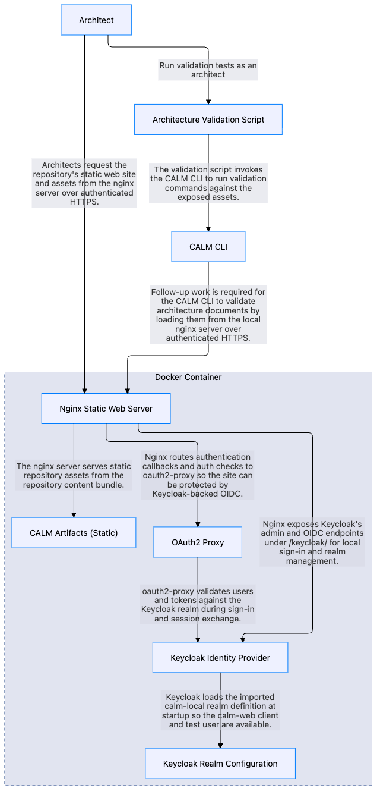

# CALM Artifact Access Testbed

Repository for serving FINOS CALM JSON content with Nginx, plus Python and TypeScript application scaffolds for future API and UI work. Local development serves repository content only over authenticated HTTPS backed by Keycloak, with an anonymous HTTPS health check for operational use.

Protected repository content is now bearer-token-only for normal access. The supported local automation path is CALM CLI direct URL loading with the `custom-idp/v2` client-credentials module against the bundled Keycloak realm.

The local `calm-direct-url` machine client uses a Keycloak service-account token. The web stack is configured to accept that bearer token directly for protected static content.

The canonical local stack origin is `https://my-arch.repo:8443`. `make start-web-server` resolves the public host from `CALM_PUBLIC_HOST`, falling back to the current auto-detected local IP only when no hostname is configured.

## Testbed CALM Architecture
[CALM Architecture JSON](docs/architecture/web-repo-architecture.json)



## Documentation
- [`docs/usage-notes.md`](docs/usage-notes.md) captures CALM CLI behavior notes for local-file vs HTTP-loaded resources.
- [`docs/validate-architecture-script.md`](docs/validate-architecture-script.md) describes the scripted CALM architecture validation checks.
- [`docs/control-validation-test-explanation.md`](docs/control-validation-test-explanation.md) explains node-level control validation results for `control-test-architecture.json`.

## Layout

- `static/architectures/` holds CALM architecture JSON files.
- `static/patterns/` holds CALM pattern JSON files.
- `static/standards/` holds CALM standard JSON files.
- `static/controls/` holds CALM control requirement schemas and control configuration JSON files.
- `apps/api/` holds the Python service scaffold (FUTURE WORK).
- `apps/web/` holds the TypeScript web scaffold (FUTURE WORK).
- `infra/nginx/` holds the Nginx config and local TLS assets.
- `infra/keycloak/` holds the local Keycloak realm template used to generate the dev import.

`/api` is reserved for future reverse proxying. Do not use that path for static assets.

## Prerequisites

- Docker and `docker-compose`
- Python 3.12+
- `uv`
- Node.js (LTS recommended)
- npm
- A local hosts-file entry such as `127.0.0.1 my-arch.repo`

## Commands

- `make bootstrap` shows dependency install commands.
- `make start-web-server` generates local TLS/auth assets and starts the full web auth stack in detached mode.
- `make stop-web-server` stops the Nginx service and removes the Compose resources.
- `make test-api` runs the Python API tests.
- `make typecheck-web` runs the TypeScript typecheck.

## Validation

- `docker-compose config` validates Compose configuration.
- `make test-api` validates Python API behavior.
- `make typecheck-web` validates TypeScript types.
- `./scripts/validate-architecture.sh` is intentionally unchanged in this repo revision and still needs a follow-up update before it matches the authenticated HTTPS-only stack.

## Control Authoring Note

- The tracked CALM source files under `static/` still use `https://localhost:8443/...` as a host-agnostic source placeholder.
- `make start-web-server` renders a served copy under `infra/nginx/rendered-static/` and rewrites those absolute JSON URLs to `https://${CALM_PUBLIC_HOST}:8443/...` before nginx starts.
- Control configuration is intentionally inlined with `config` for architecture requirements in this repo.
- Keep control configs in `static/controls/**/configs/*.json` as reusable source artifacts, but copy values inline when updating architecture control requirements. At present there appears to be a false-positive error when the config-url is used.

## Static Content

Static content is available only through the authenticated HTTPS endpoint. Requests without a valid bearer token receive `401 Unauthorized`. The only anonymous endpoint exposed by the web server is `/healthz`.

Sample authenticated URLs after `make start-web-server`:

- `https://my-arch.repo:8443/`
- `https://my-arch.repo:8443/architectures/calm-1.json`
- `https://my-arch.repo:8443/patterns/company-base-pattern.json`
- `https://my-arch.repo:8443/standards/company-node-standard.json`
- `https://my-arch.repo:8443/controls/security/schemas/tls-encryption.json`

Anonymous health check:

- `https://my-arch.repo:8443/healthz`

The Keycloak admin console uses the same HTTPS origin:

- `https://my-arch.repo:8443/keycloak/admin/master/console/`

For bearer-token CLI flows using CALM `directUrlAuth`, `my-arch.repo` is the preferred origin. `localhost` remains accepted by the CLI for compatibility when the stack origin file points at a different local hostname.

## Install

Python (FUTURE WORK):

```sh
cd apps/api
uv sync
```

TypeScript (FUTURE WORK):

```sh
cd apps/web
npm install
```

## Web Server

### Start

1. Copy `.env.example` to `.env`.
2. Ensure your local resolver maps `my-arch.repo` to `127.0.0.1`.
3. Set local-only values for:
   - `CALM_PUBLIC_HOST`
   - `KC_BOOTSTRAP_ADMIN_PASSWORD`
   - `OAUTH2_PROXY_CLIENT_SECRET`
   - `OAUTH2_PROXY_COOKIE_SECRET`
   - `KEYCLOAK_DIRECT_URL_CLIENT_SECRET`
   - `KEYCLOAK_TEST_USER_PASSWORD`
4. Start the full local stack:

```sh
make start-web-server
```

`make start-web-server` will:

- resolve `CALM_PUBLIC_HOST` from the shell, `.env`, or the current auto-detected local IP and export it for the startup sequence
- run `./scripts/generate-local-certs.sh` to create `infra/nginx/certs/localhost.crt` and `infra/nginx/certs/localhost.key` if they are missing, or regenerate them if the detected host is not present in the certificate SANs
- run `./scripts/render-keycloak-realm.py` to render `infra/keycloak/calm-local-realm.template.json` into `infra/keycloak/import/calm-local-realm.json` using values from `.env`
- run `./scripts/render-direct-url-auth-config.py` to generate `custom-idp/v2/generated/direct-url-auth.json` for the local machine client
- run `./scripts/render-static-content.py` to create the served `infra/nginx/rendered-static/` tree with absolute JSON URLs rewritten to the configured HTTPS origin
- start `keycloak`, `oauth2-proxy`, and `nginx`
- serve repository content only through bearer-token-authenticated HTTPS
- serve the Keycloak admin console through the HTTPS Keycloak path

If you need a cookie secret, generate one with:

```sh
openssl rand -hex 16
```

If you need a machine-client secret for the local Keycloak `calm-direct-url` client, generate one with:

```sh
openssl rand -hex 24
```

### CALM CLI direct URL auth

Build the supported local auth module:

```sh
cd custom-idp/v2
npm install
npm test
```

Point `~/.calm.json` at the built module and the generated local config:

```json
{
  "allowedRemoteHosts": ["my-arch.repo", "localhost"],
  "directUrlAuth": {
    "module": "/absolute/path/to/setup-keycloak-web/custom-idp/v2/dist/direct-url-auth.js",
    "configPath": "/absolute/path/to/setup-keycloak-web/custom-idp/v2/generated/direct-url-auth.json"
  }
}
```

Then protected documents can be fetched non-interactively, for example:

```sh
calm validate -a https://my-arch.repo:8443/architectures/calm-1.json
```

### Stop

Stop the static server and remove the Compose resources:

```sh
make stop-web-server
```

## API Access
Run the API directly (FUTURE WORK):

```sh
cd apps/api
uv run uvicorn calm_api.main:app --reload
```

Run the web app directly (FUTURE WORK):

```sh
cd apps/web
npm run dev
```

## Secret Handling

- Real secrets stay in local `.env`, `infra/nginx/certs/`, `infra/keycloak/import/`, and generated ignored direct-url auth config files.
- `.env.example` is safe to commit because it contains placeholders only.
- `.gitignore` excludes `.env`, local certificates, generated Keycloak import artifacts, and generated direct-url auth config so they do not get committed to the public repository.
- The tracked Keycloak file is a template; the real client secrets and test-user password are rendered locally before startup.
