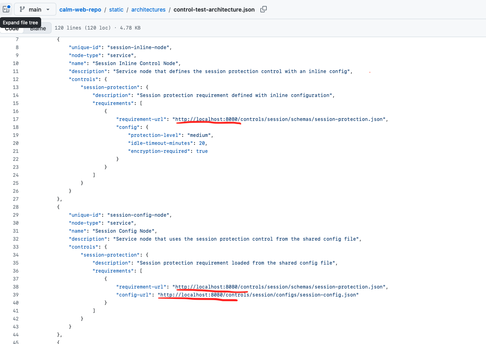
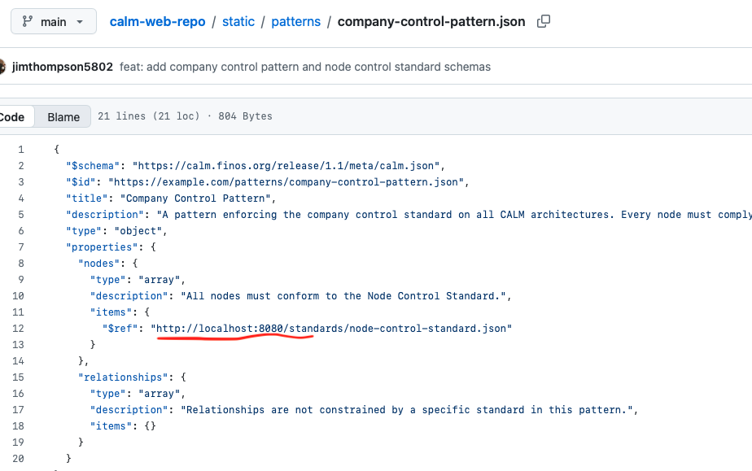
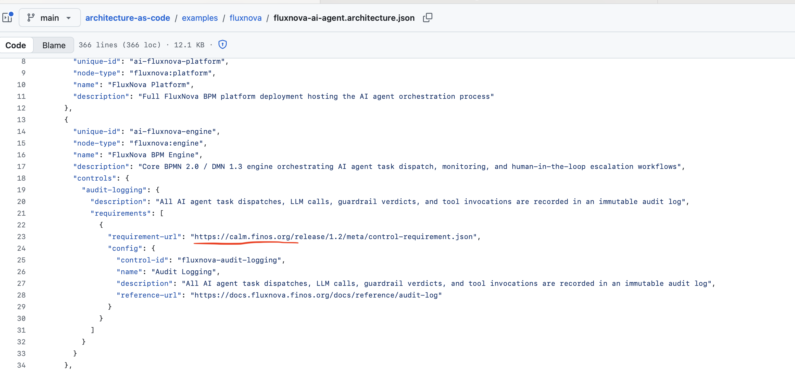

For references that point to related CALM files (architectures, patterns, standards, controls), the design intent is to be of the form
```
https://calmhub.example.com/architectures/control-test-architecture.json

https://calmhub.example.com/controls/session/schemas/session-protection.json

https://calmhub.example.com/controls/session/configs/session-config.json

https://calmhub.example.com/standards/node-control-standard.json

https://calmhub.example.com/patterns/company-control-pattern.json
```







and a `calm validate` execution in  CI/CD pipeline would have this form...

```
calm  validate -a https://calmhub.example.com/architectures/control-test-architecture.json -p https://calmhub.example.com/patterns/company-control-pattern.json
```

The use of `url-mapping.json` is local development and testing aid to support the url mapping to a local file.