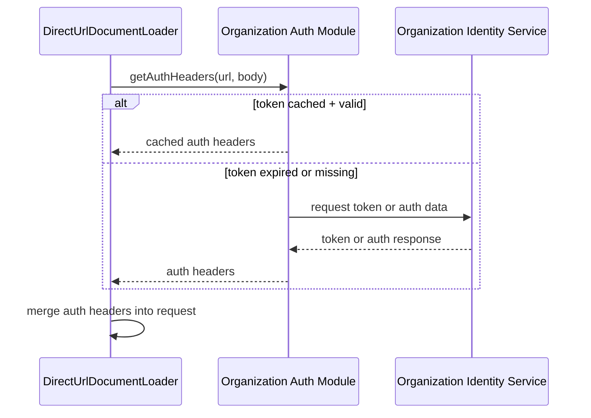

# Direct URL Auth Module Code Examples

This document provides example code aligned to the simplified design in
[general-idp-authplugin-design.md](/Users/jim/Desktop/finos/calm-web-repo/docs/general-idp-authplugin-design.md).

The examples focus on one core idea: an end-user organization provides a module
that can supply the authentication information needed for a protected direct URL
request, and the direct URL loading path adds that information to the outbound
request before sending it.

These examples are illustrative. They show one possible way to structure the
organization module and the request augmentation step, but they are not meant
to freeze final package names or exact product APIs.

## 1) Example: organization-provided auth module

This example shows an organization-owned module that returns request headers for
protected direct URL fetches. Internally it uses a client-credentials token
request, but that internal logic belongs to the organization module rather than
the core product requirement.

```ts
export type DirectUrlAuthContext = {
  url: string;
  body?: unknown;
};

export type AcmeDirectUrlAuthModuleOptions = {
  baseUrl: string;
  realm: string;
  clientId: string;
  clientSecret?: string;
  clientSecretEnvVar?: string;
  audience?: string;
  scopes?: string[];
};

type CachedToken = {
  accessToken: string;
  expiresAtEpochMs: number;
};

type TokenResponse = {
  access_token: string;
  expires_in?: number;
};

export default class AcmeDirectUrlAuthModule {
  private readonly tokenUrl: string;
  private readonly clientId: string;
  private readonly clientSecret?: string;
  private readonly audience?: string;
  private readonly scopes: string[];
  private cachedToken?: CachedToken;

  constructor(options: AcmeDirectUrlAuthModuleOptions) {
    if (!options.baseUrl) throw new Error("baseUrl is required");
    if (!options.realm) throw new Error("realm is required");
    if (!options.clientId) throw new Error("clientId is required");

    const baseUrl = options.baseUrl.replace(/\/+$/, "");
    this.tokenUrl =
      `${baseUrl}/realms/${encodeURIComponent(options.realm)}/protocol/openid-connect/token`;
    this.clientId = options.clientId;
    this.clientSecret = this.resolveSecret(options);
    this.audience = options.audience;
    this.scopes = options.scopes ?? [];
  }

  async getAuthHeaders(
    _context: DirectUrlAuthContext
  ): Promise<Record<string, string>> {
    const accessToken = await this.getAccessToken();

    return {
      Authorization: `Bearer ${accessToken}`,
    };
  }

  private async getAccessToken(): Promise<string> {
    if (this.cachedToken && Date.now() < this.cachedToken.expiresAtEpochMs - 60_000) {
      return this.cachedToken.accessToken;
    }

    const body = new URLSearchParams();
    body.set("grant_type", "client_credentials");
    body.set("client_id", this.clientId);

    if (this.clientSecret) {
      body.set("client_secret", this.clientSecret);
    }

    if (this.audience) {
      body.set("audience", this.audience);
    }

    if (this.scopes.length > 0) {
      body.set("scope", this.scopes.join(" "));
    }

    const response = await fetch(this.tokenUrl, {
      method: "POST",
      headers: {
        "content-type": "application/x-www-form-urlencoded",
        accept: "application/json",
      },
      body,
    });

    if (!response.ok) {
      const text = await response.text().catch(() => "");
      throw new Error(
        `Token request failed: ${response.status} ${response.statusText}${text ? ` - ${text}` : ""}`
      );
    }

    const json = (await response.json()) as TokenResponse;

    if (!json.access_token) {
      throw new Error("Token response missing access_token");
    }

    const expiresInMs = (json.expires_in ?? 300) * 1000;
    this.cachedToken = {
      accessToken: json.access_token,
      expiresAtEpochMs: Date.now() + expiresInMs,
    };

    return this.cachedToken.accessToken;
  }

  private resolveSecret(
    options: AcmeDirectUrlAuthModuleOptions
  ): string | undefined {
    if (options.clientSecret) {
      return options.clientSecret;
    }

    if (options.clientSecretEnvVar) {
      const value = process.env[options.clientSecretEnvVar];
      if (!value) {
        throw new Error(
          `Environment variable ${options.clientSecretEnvVar} is not set`
        );
      }
      return value;
    }

    return undefined;
  }
}
```

## 2) Example: direct URL request augmentation

This example shows the important product-side behavior: the direct URL loading
path asks the organization module for authentication information and merges the
returned headers into the outgoing request.

```ts
export type DirectUrlAuthModule = {
  getAuthHeaders(
    context: { url: string; body?: unknown }
  ): Promise<Record<string, string>>;
};

export async function applyDirectUrlAuth(
  request: {
    url: string;
    body?: unknown;
    headers?: Record<string, string>;
  },
  authModule?: DirectUrlAuthModule
) {
  if (!authModule) {
    return request;
  }

  const authHeaders = await authModule.getAuthHeaders({
    url: request.url,
    body: request.body,
  });

  return {
    ...request,
    headers: {
      ...(request.headers ?? {}),
      ...authHeaders,
    },
  };
}
```

## 3) Runtime interaction

The runtime interaction is intentionally simple:

1. The CLI reads configuration for direct URL authentication.
2. The CLI loads the organization module identified by that configuration.
3. The direct URL path asks the module for authentication information for the
   current request.
4. The returned headers are appended to the outbound request.
5. The request is sent to the protected URL.

### Sequence diagram



## 4) Minimal wiring example

This example keeps the wiring generic. The configuration points to an
organization module, the CLI loads it dynamically, and the direct URL path uses
it as the source of request authentication data.

```ts
export async function createDirectUrlAuthModule(config: {
  module: string;
  options?: Record<string, unknown>;
}) {
  const mod = await import(config.module);
  const OrganizationAuthModule = mod.default;

  if (!OrganizationAuthModule) {
    throw new Error(`Module ${config.module} must export a default class`);
  }

  const authModule = new OrganizationAuthModule(config.options ?? {});

  if (typeof authModule.getAuthHeaders !== "function") {
    throw new Error(
      `Module ${config.module} must provide getAuthHeaders(context)`
    );
  }

  return authModule as {
    getAuthHeaders(context: {
      url: string;
      body?: unknown;
    }): Promise<Record<string, string>>;
  };
}
```

## 5) Configuration example

This example shows only the configuration detail needed to locate the
organization module and pass options into it.

```json
{
  "directUrlAuth": {
    "module": "@acme/calm-direct-url-auth",
    "options": {
      "baseUrl": "https://idp.acme.internal",
      "realm": "acme-prod",
      "clientId": "calm-cli",
      "clientSecretEnvVar": "CALM_CLIENT_SECRET"
    }
  }
}
```

## 6) Consistency with the simplified design

These examples are consistent with the simplified design document because they
show only the following required behaviors:

- The organization owns the module that knows how to obtain authentication
  information.
- The direct URL path asks that module for request-specific authentication
  data.
- The request is augmented before it is sent.
- Existing CALM Hub authentication is outside the scope of these examples and
  remains unchanged.
