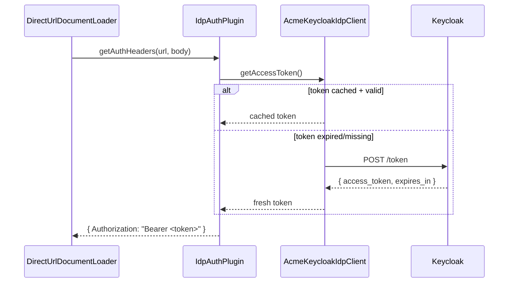

# IdP Auth Plugin Code Examples

This document collects practical examples for:

- `acme-keycloak-idp-client.ts` implementing `IdpClient`
- `IdpAuthPlugin` wrapping any `IdpClient` into request headers
- How `IdpAuthPlugin` interacts with the external Acme Keycloak module at runtime

## 1) Example: `acme-keycloak-idp-client.ts` (`IdpClient` implementation)

```ts
import type { IdpClient } from "@finos/calm-auth";

export type AcmeKeycloakIdpClientOptions = {
  baseUrl: string;                  // e.g. "https://idp.acme.internal"
  realm: string;                    // e.g. "acme-prod"
  clientId: string;                 // e.g. "calm-cli"
  clientSecret?: string;            // optional if using env var
  clientSecretEnvVar?: string;      // e.g. "CALM_CLIENT_SECRET"
  scopes?: string[];                // optional OAuth scopes
  audience?: string;                // optional audience param if used by your Keycloak config
  tokenPath?: string;               // override token path if needed
  clockSkewSeconds?: number;        // refresh early, default 60s
};

type CachedToken = {
  accessToken: string;
  expiresAtEpochMs: number;
};

type TokenResponse = {
  access_token: string;
  expires_in?: number;
  token_type?: string;
  scope?: string;
};

export default class AcmeKeycloakIdpClient implements IdpClient {
  private readonly tokenUrl: string;
  private readonly clientId: string;
  private readonly clientSecret?: string;
  private readonly scopes: string[];
  private readonly audience?: string;
  private readonly clockSkewSeconds: number;
  private cachedToken?: CachedToken;

  constructor(options: AcmeKeycloakIdpClientOptions) {
    if (!options.baseUrl) throw new Error("baseUrl is required");
    if (!options.realm) throw new Error("realm is required");
    if (!options.clientId) throw new Error("clientId is required");

    const baseUrl = options.baseUrl.replace(/\/+$/, "");
    const tokenPath =
      options.tokenPath ??
      `/realms/${encodeURIComponent(options.realm)}/protocol/openid-connect/token`;

    this.tokenUrl = `${baseUrl}${tokenPath}`;
    this.clientId = options.clientId;
    this.clientSecret = this.resolveSecret(options);
    this.scopes = options.scopes ?? [];
    this.audience = options.audience;
    this.clockSkewSeconds = options.clockSkewSeconds ?? 60;
  }

  async getAccessToken(): Promise<string> {
    if (this.isCachedTokenValid()) {
      return this.cachedToken!.accessToken;
    }

    const token = await this.fetchToken();
    this.cachedToken = token;
    return token.accessToken;
  }

  private isCachedTokenValid(): boolean {
    if (!this.cachedToken) return false;
    const refreshEarlyMs = this.clockSkewSeconds * 1000;
    return Date.now() + refreshEarlyMs < this.cachedToken.expiresAtEpochMs;
  }

  private async fetchToken(): Promise<CachedToken> {
    const body = new URLSearchParams();
    body.set("grant_type", "client_credentials");
    body.set("client_id", this.clientId);

    if (this.clientSecret) {
      body.set("client_secret", this.clientSecret);
    }

    if (this.scopes.length > 0) {
      body.set("scope", this.scopes.join(" "));
    }

    if (this.audience) {
      body.set("audience", this.audience);
    }

    const res = await fetch(this.tokenUrl, {
      method: "POST",
      headers: {
        "content-type": "application/x-www-form-urlencoded",
        accept: "application/json",
      },
      body,
    });

    if (!res.ok) {
      const errText = await res.text().catch(() => "");
      throw new Error(
        `Keycloak token request failed: ${res.status} ${res.statusText}${errText ? ` - ${errText}` : ""}`
      );
    }

    const json = (await res.json()) as TokenResponse;

    if (!json.access_token) {
      throw new Error("Token response missing access_token");
    }

    const expiresInSec = this.resolveExpiresInSeconds(json);
    const expiresAtEpochMs = Date.now() + expiresInSec * 1000;

    return {
      accessToken: json.access_token,
      expiresAtEpochMs,
    };
  }

  private resolveSecret(options: AcmeKeycloakIdpClientOptions): string | undefined {
    if (options.clientSecret) return options.clientSecret;

    if (options.clientSecretEnvVar) {
      const value = process.env[options.clientSecretEnvVar];
      if (!value) {
        throw new Error(
          `Environment variable ${options.clientSecretEnvVar} is not set`
        );
      }
      return value;
    }

    return undefined;
  }

  private resolveExpiresInSeconds(json: TokenResponse): number {
    if (typeof json.expires_in === "number" && json.expires_in > 0) {
      return json.expires_in;
    }

    const exp = this.tryReadJwtExp(json.access_token);
    if (exp) {
      const nowSec = Math.floor(Date.now() / 1000);
      return Math.max(30, exp - nowSec);
    }

    return 300;
  }

  private tryReadJwtExp(token: string): number | undefined {
    try {
      const parts = token.split(".");
      if (parts.length < 2) return undefined;

      const payload = JSON.parse(
        Buffer.from(parts[1].replace(/-/g, "+").replace(/_/g, "/"), "base64").toString("utf8")
      ) as { exp?: number };

      return typeof payload.exp === "number" ? payload.exp : undefined;
    } catch {
      return undefined;
    }
  }
}
```

## 2) Example: `IdpAuthPlugin`

```ts
import type { AuthPlugin } from "@finos/calm-shared";
import type { IdpClient } from "@finos/calm-auth";

export type IdpAuthPluginOptions = {
  // If omitted, defaults to "Authorization"
  headerName?: string;
  // If omitted, defaults to "Bearer"
  // Ignored when headerName is set to a non-Authorization header
  headerPrefix?: string;
};

export class IdpAuthPlugin implements AuthPlugin {
  private readonly idpClient: IdpClient;
  private readonly headerName: string;
  private readonly headerPrefix: string;

  constructor(idpClient: IdpClient, options: IdpAuthPluginOptions = {}) {
    this.idpClient = idpClient;
    this.headerName = options.headerName ?? "Authorization";
    this.headerPrefix = options.headerPrefix ?? "Bearer";
  }

  async getAuthHeaders(
    _url?: string,
    _body?: unknown
  ): Promise<Record<string, string>> {
    const token = await this.idpClient.getAccessToken();

    if (!token) {
      throw new Error("Idp client returned an empty token");
    }

    // API key style: { "X-API-Key": "<token>" }
    if (this.headerName.toLowerCase() !== "authorization") {
      return { [this.headerName]: token };
    }

    // OAuth bearer style: { "Authorization": "Bearer <token>" }
    return { [this.headerName]: `${this.headerPrefix} ${token}` };
  }
}
```

## 3) Interaction: `IdpAuthPlugin` with `@acme/calm-keycloak-idp`

`IdpAuthPlugin` does not fetch tokens directly. It delegates token retrieval to the external IdP client module (for example `@acme/calm-keycloak-idp`) through the `IdpClient` interface.

### Runtime sequence

1. CLI reads `directUrlAuth` config.
2. For `type: "custom"`, CLI dynamically imports the module in `directUrlAuth.module`.
3. CLI constructs `new AcmeKeycloakIdpClient(options)`.
4. CLI wraps it: `new IdpAuthPlugin(acmeClient)`.
5. Direct URL loader calls `getAuthHeaders(url, body)`.
6. `IdpAuthPlugin` calls `acmeClient.getAccessToken()`.
7. Acme client obtains/caches/refreshes token from Keycloak.
8. `IdpAuthPlugin` returns request headers (default `Authorization: Bearer <token>`).

### Sequence diagram



### Minimal wiring example (dynamic import + wrapper)

```ts
import { IdpAuthPlugin } from "@finos/calm-auth";

export async function createDirectUrlAuthPlugin(config: {
  type: "custom";
  module: string;
  options?: Record<string, unknown>;
}) {
  const mod = await import(config.module);
  const AcmeClient = mod.default;

  if (!AcmeClient) {
    throw new Error(`Module ${config.module} must export default class`);
  }

  const idpClient = new AcmeClient(config.options ?? {});
  return new IdpAuthPlugin(idpClient);
}
```

## 4) Configuration example (`~/.calm.json`)

```json
{
  "directUrlAuth": {
    "type": "custom",
    "module": "@acme/calm-keycloak-idp",
    "options": {
      "baseUrl": "https://idp.acme.internal",
      "realm": "acme-prod",
      "clientId": "calm-cli",
      "clientSecretEnvVar": "CALM_CLIENT_SECRET",
      "scopes": ["openid", "profile"]
    }
  }
}
```