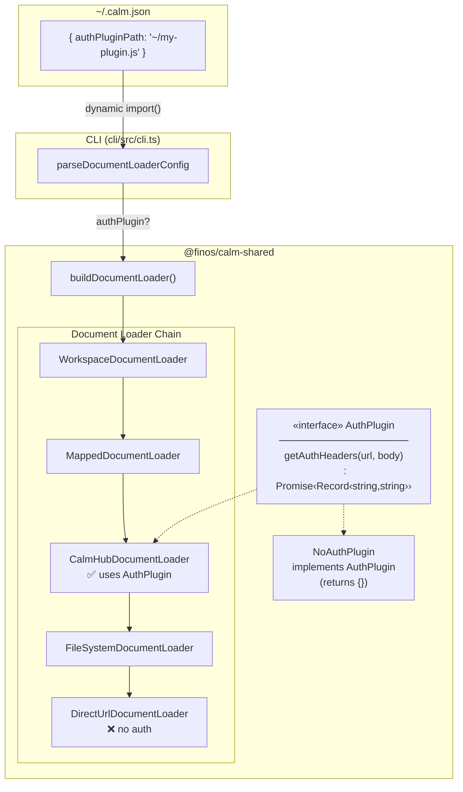
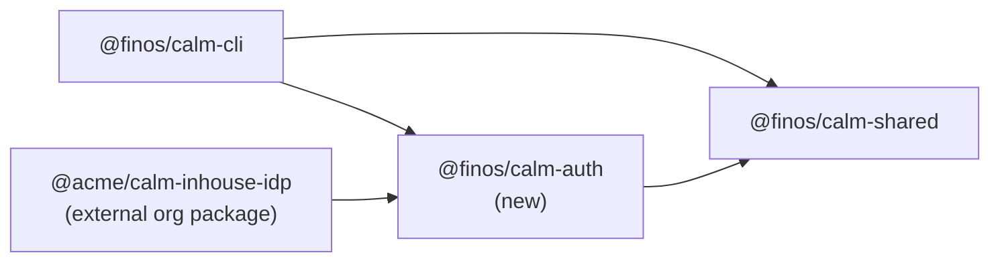
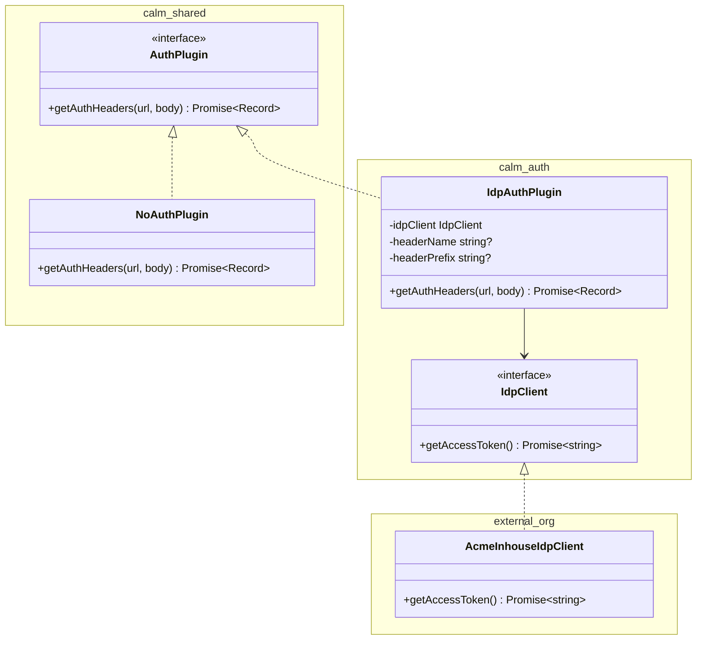
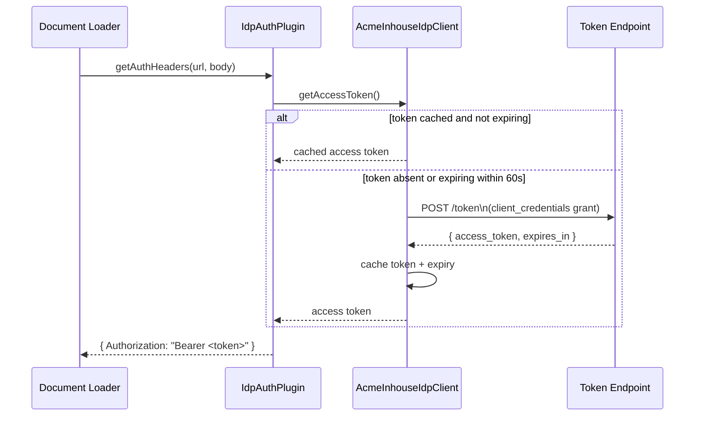
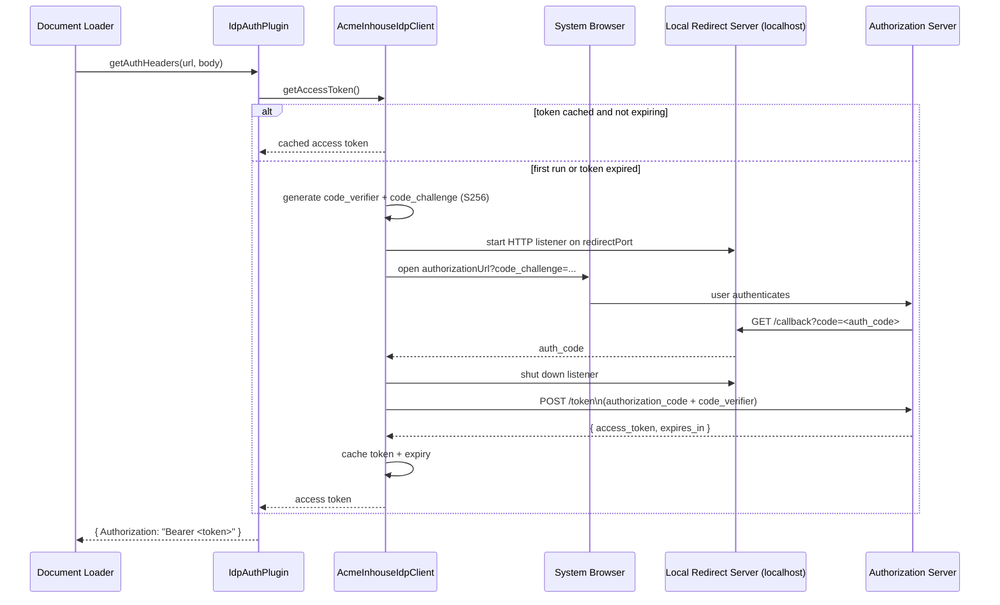
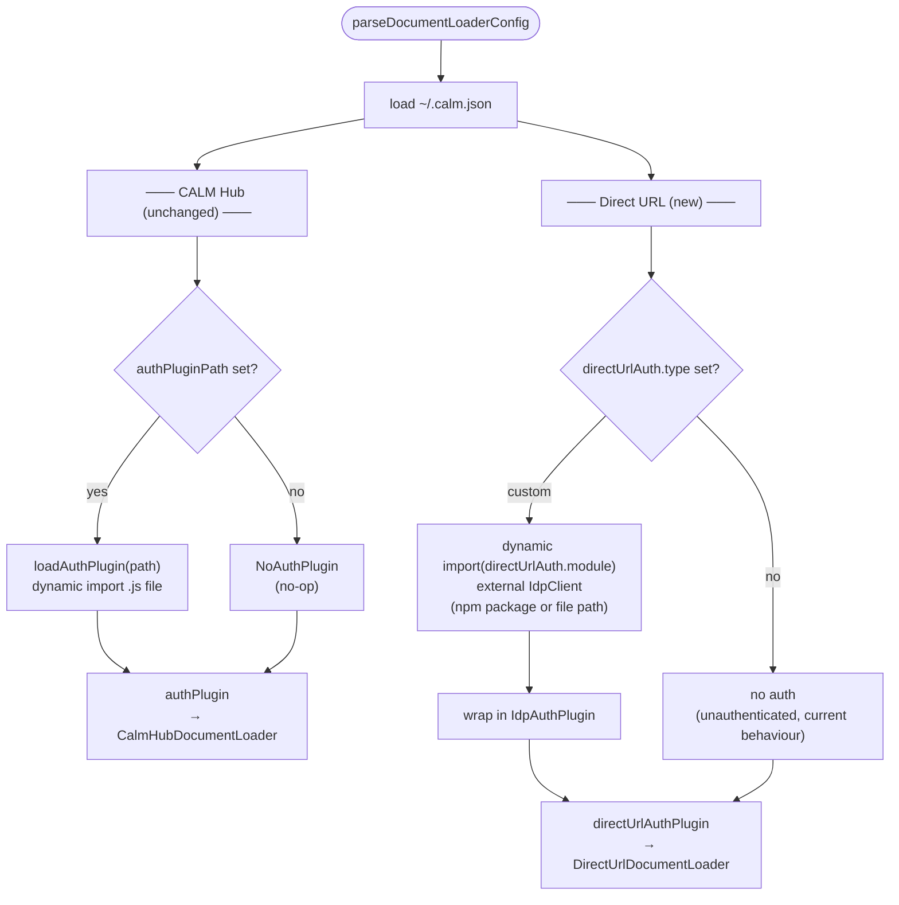
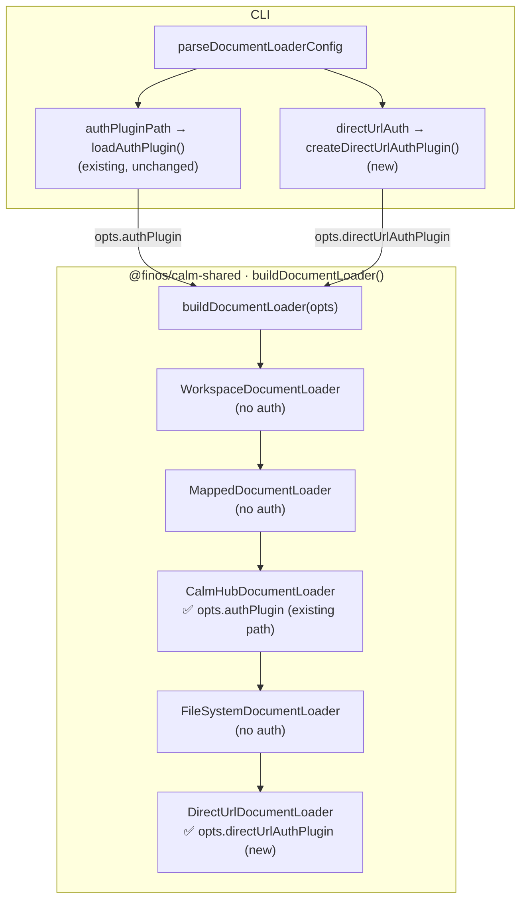
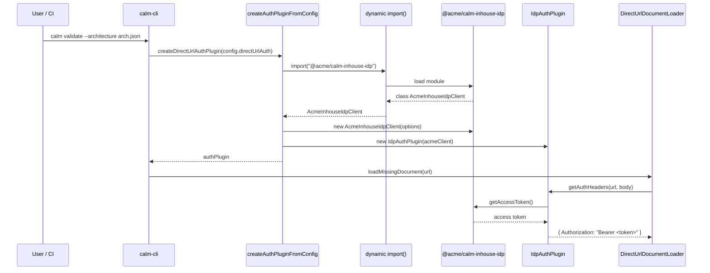
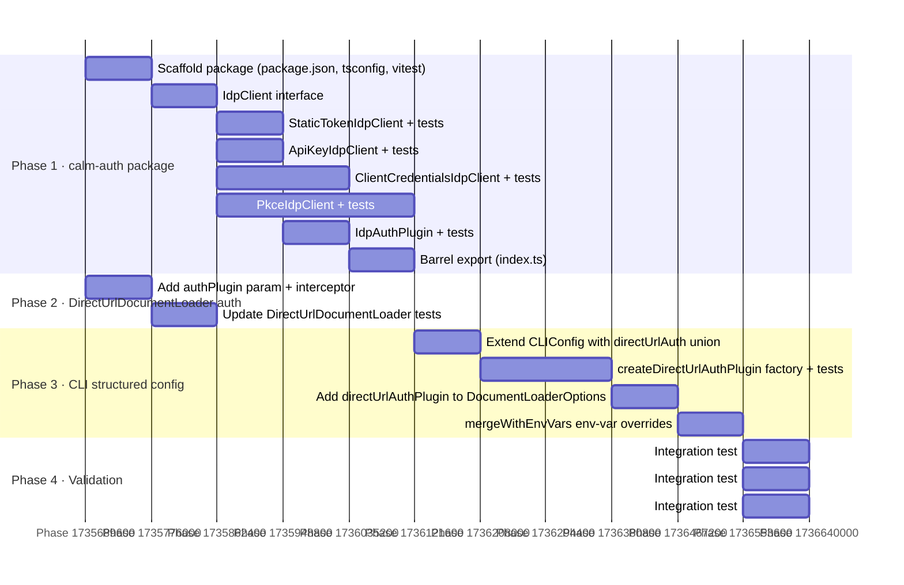

# Generalised IDP Auth Plugin Design

## Overview

This document simplifies the requirement for adding authentication support to
`DirectUrlDocumentLoader`.

The main requirement is straightforward: an end-user organization must be able
to provide a module that returns the authentication information needed for a
protected direct-URL request, and the direct URL loading path must add that
information to the outbound request before the fetch is sent.

The existing CALM Hub authentication path remains unchanged. This work only
adds a direct URL integration point for organization-specific authentication.

The Mermaid diagrams in this document are retained from the earlier draft.
Where they show concrete package names, protocol examples, or config names,
read those as illustrative examples of where the change applies rather than as
final required implementation detail.

---

## Current State

Today, authentication support exists only for the CALM Hub path. The direct URL
path sends unauthenticated HTTP requests, so documents behind organization
identity controls cannot be loaded. The practical gap is not the lack of a
specific OAuth flow; it is the lack of a place for an organization module to
supply the authentication information required by its own environment.

The change implied by this gap is simple:

1. The direct URL path needs its own authentication integration point.
2. That integration point must accept organization-supplied authentication
   information for the request being made.
3. Existing CALM Hub authentication behavior stays as-is.

---

## Proposed Design

The revised design centers on one idea: the product must accept an
organization-provided module for direct URL authentication, ask it for the
authentication information needed for the target request, and append that
information before the request is sent.

This means the implementation changes are focused in a few high-level areas:
the CLI or configuration path must resolve the organization module, the direct
URL loader path must call it, and the outbound request must be augmented with
the returned authentication data. The document does not need to require a
particular set of built-in flows to achieve that.

### Package Dependency Graph

The dependency diagram below still shows one possible structural shape. For the
purposes of this requirement, the important point is simply that organization
authentication logic can live outside this repository and be consumed by the
direct URL path.

### Interface Layer

At the interface level, the only requirement that matters is that the
organization module can provide what the direct URL request needs in order to
authenticate. The specific class names in the diagram are illustrative examples. The design intent is for an organization to implement their specific logic
in a module separate from the CALM project using an minimal interface specification defined by the CALM project and the direct URL loader consumes the end user organization information to facilitate authentication.

### Example Authentication Flows

The next two diagrams are retained as examples of how an organization module
might obtain authentication information before the request is augmented. They
should not be read as a commitment to ship all of these flows as built-in
product features. The requirement is only that the system can work with an
organization module that knows how to obtain the needed authentication data.

#### Client Credentials (OAuth2 RFC 6749 §4.4)

#### Authorization Code + PKCE (RFC 7636)

---

### Auth Resolution in the CLI

The CLI needs to keep the two authentication paths distinct. CALM Hub continues
to resolve authentication exactly as it does today. The new behavior is that
the direct URL path resolves an organization module and prepares it for request
augmentation on protected direct-URL fetches.

The direct URL path gains a dedicated resolution step for organization-provided
authentication data, while the CALM Hub path is left untouched.

---

### Document Loader Chain (After Change)

In the loader chain, the change is that direct URL loading receives
authentication input from the organization module and applies that input to the
request. This is where the request augmentation actually affects document
retrieval behavior.

What changes will be made at this layer is now clear:
the direct URL loader gains a way to receive organization-provided
authentication information, it adds that information to outbound requests, and
the existing CALM Hub wiring continues to behave exactly as it does today.

---

### External Organisation IDP Support

The organization module is expected to be owned by the end-user organization
when the authentication requirements are organization-specific. That module can
live outside this repository, evolve independently, and carry whatever internal
logic is needed to gather the authentication information for protected direct
URLs.

The required product change is therefore not "implement every possible
enterprise auth flow in this repository." It is "provide a supported path for
an organization module to participate in direct URL authentication."

In practical terms, the direct URL path changes by loading the organization
module, asking it for authentication information, and using the returned data
to augment the outgoing request. No equivalent change is required for the
existing CALM Hub path.

---

### Configuration Reference

Configuration still needs a way to tell the CLI how to locate or activate the
organization module for direct URL authentication. The earlier draft used
`directUrlAuth` as the working example, and the retained diagrams continue to
show that name, but the key requirement is conceptual rather than syntactic:
there must be enough configuration to connect the direct URL path to the
organization-provided authentication module.

The document deliberately does not require a final union shape, a fixed set of
built-in flow types, or a detailed environment-variable matrix. Those are
implementation choices. The requirement is simply that protected direct URL
requests can be augmented with authentication data supplied by the organization
module, while current CALM Hub configuration continues to work unchanged.

---

## Implementation Plan

The retained plan diagram still usefully shows the main surfaces that change:
module resolution, direct URL request wiring, and validation. For this revised
document, read it as an illustration of impacted areas rather than as a locked,
phase-by-phase delivery commitment.

The high-level implementation changes captured by this simplified document are:
the direct URL loading path gains an organization-module integration point, the
module provides authentication data needed for the request, the loader appends
that data before sending the request, and compatibility with the existing CALM
Hub authentication path is preserved.

## Constraints and Notes

- Backward compatibility is required: current CALM Hub authentication remains
  unchanged.
- The organization module owns the logic for obtaining whatever authentication
  information its environment requires.
- The direct URL path owns request augmentation, meaning it applies the module
  output to the outbound request before fetching the document.
- Specific protocols, package names, and config shapes shown in diagrams are
  illustrative unless and until implementation work chooses concrete forms.
