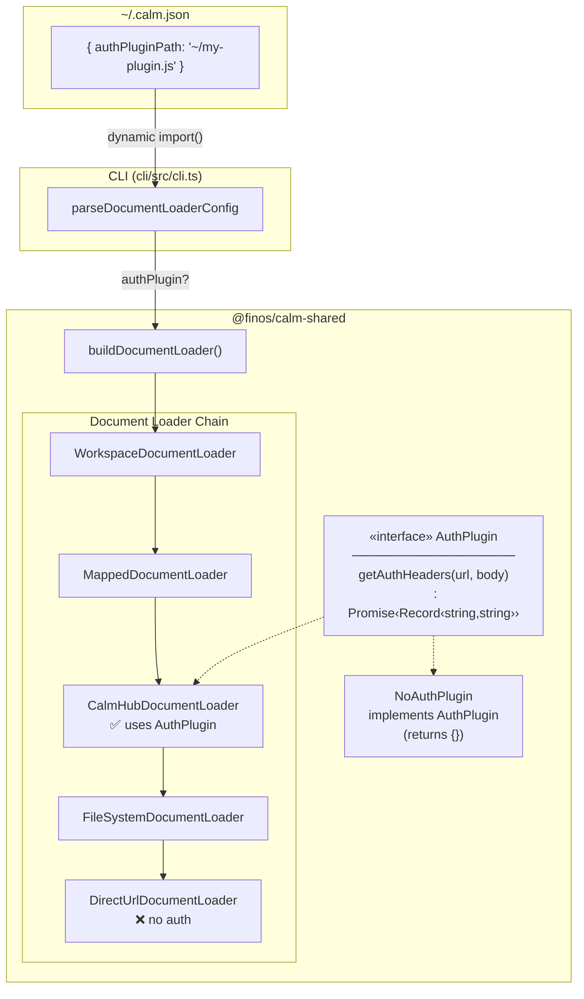
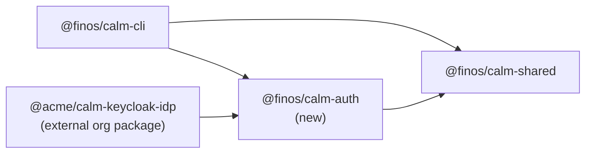
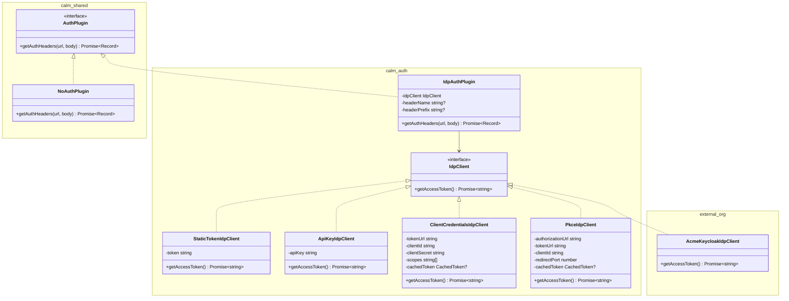
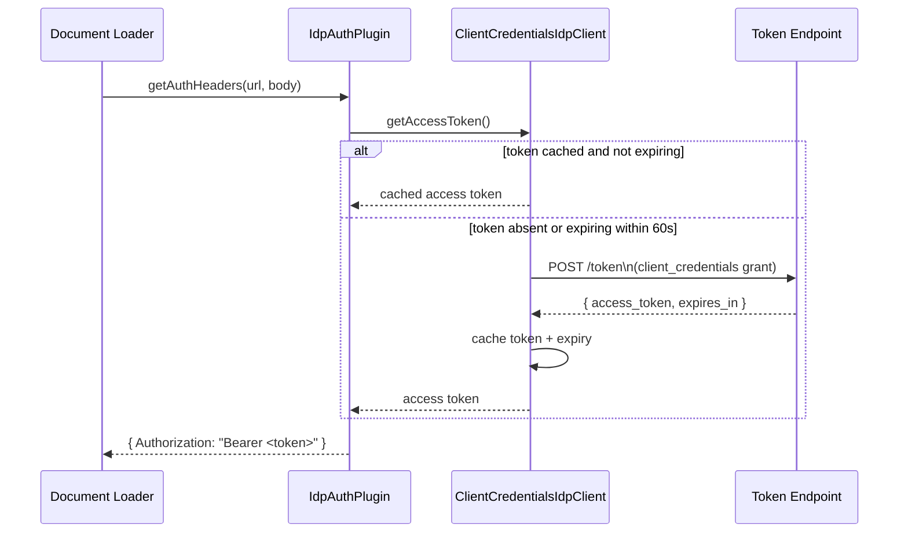
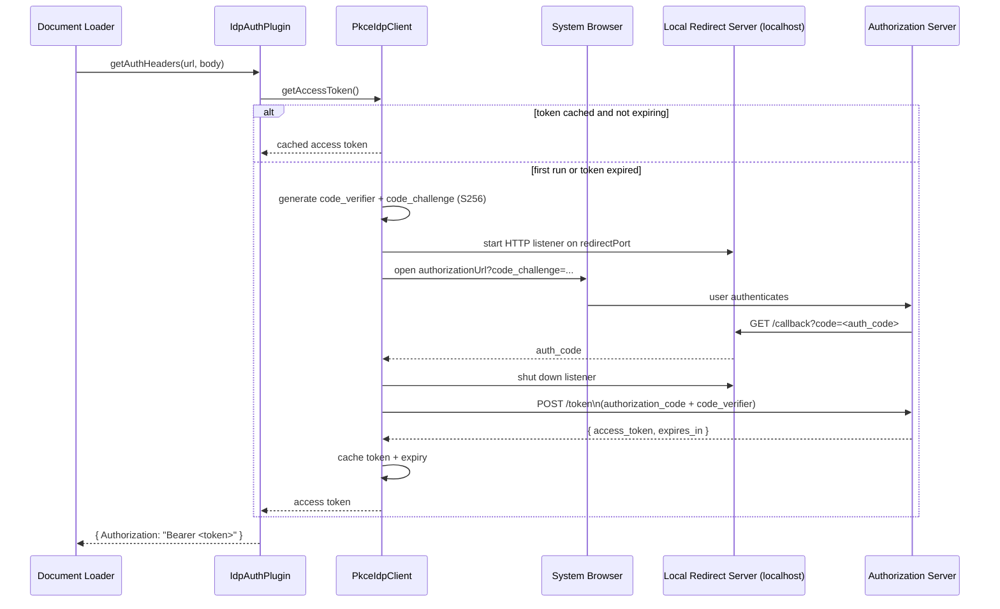
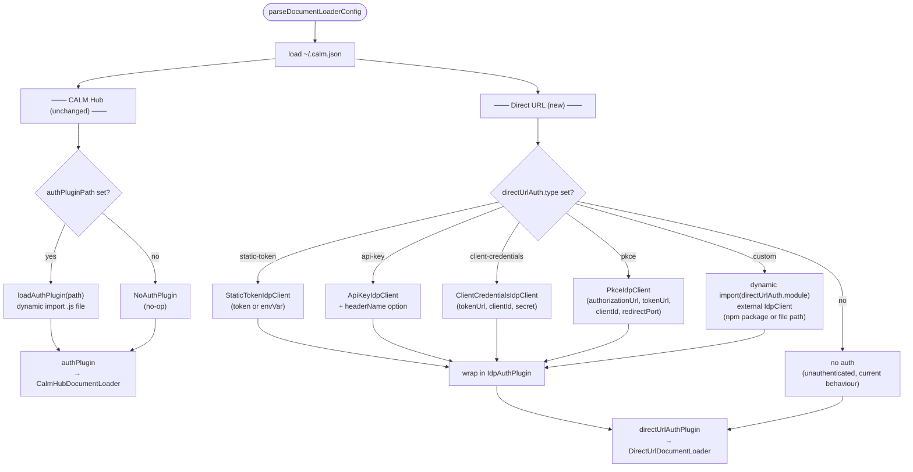
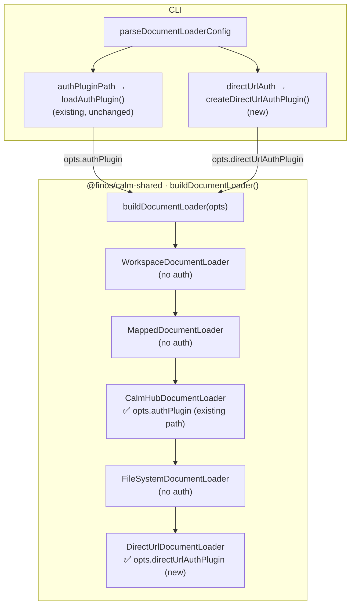
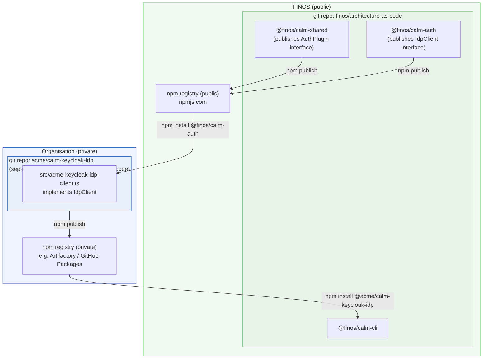
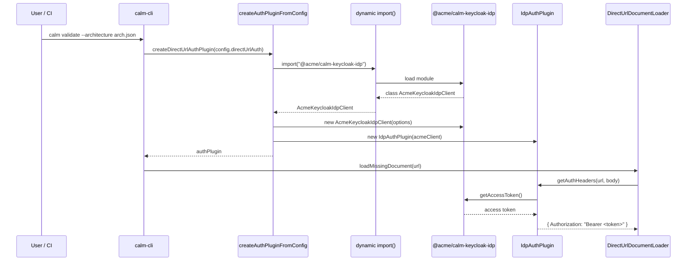
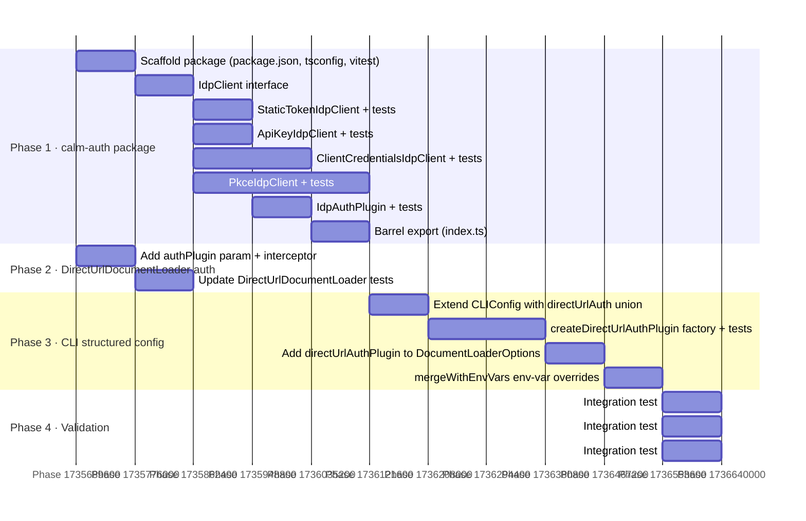

# Generalised IDP Auth Plugin Design

## Overview

This document describes a design to add authentication support to the `DirectUrlDocumentLoader`
in the `architecture-as-code` repo, with a pluggable IDP abstraction that allows organisations
to bring their own Identity Provider without modifying this repository.

**The existing CALM Hub authentication mechanism (`authPluginPath` / `AuthPlugin`) is left
completely unchanged.** The new IDP abstraction applies exclusively to the `DirectUrlDocumentLoader`
and is configured through a separate `directUrlAuth` block in `~/.calm.json`. Both loaders can
therefore operate under different credentials simultaneously.

---

## Current State

Authentication support exists only for the CALM Hub loader. The `DirectUrlDocumentLoader` makes
unauthenticated HTTP requests, meaning any document served behind an IDP-protected URL cannot be
fetched. The only extension point is `authPluginPath` in `~/.calm.json`, which dynamically loads
a user-supplied `.js` file that implements the `AuthPlugin` interface in full.



**Gaps in the current design:**

1. `DirectUrlDocumentLoader` receives no `AuthPlugin` — documents at auth-protected `https://`
   URLs cannot be fetched.
2. There is no structured configuration for common IDP flows (OAuth2, static token, API key)
   for direct URL access; the only extension point (`authPluginPath`) is scoped to CALM Hub
   and requires writing a full `AuthPlugin` implementation in JavaScript.
3. Organisations cannot configure independent credentials for CALM Hub vs. direct URL sources.

---

## Proposed Design

The design introduces two things:

1. **A new `@finos/calm-auth` package** containing an `IdpClient` interface and built-in
   implementations for common IDP flows. An `IdpAuthPlugin` bridge adapts any `IdpClient` into
   the existing `AuthPlugin` interface.
2. **Auth wired into `DirectUrlDocumentLoader`** via its own separate `directUrlAuthPlugin`
   field in `DocumentLoaderOptions`, using the same axios interceptor pattern already used by
   `CalmHubDocumentLoader` — but fed from a completely independent configuration path.

The `authPlugin` field in `DocumentLoaderOptions` (used by `CalmHubDocumentLoader`) and the
existing `authPluginPath` / `loadAuthPlugin` code path in the CLI are **not modified**.

### Package Dependency Graph



`AuthPlugin` stays in `@finos/calm-shared` so all existing consumers are unaffected. `@finos/calm-auth`
depends on `@finos/calm-shared` for that interface. External org packages depend only on
`@finos/calm-auth` for the `IdpClient` contract.

---

### Interface Layer



The `IdpAuthPlugin` is the sole bridge between the token world (`IdpClient`) and the header world
(`AuthPlugin`). Its constructor accepts an optional `headerName` (for API keys) and `headerPrefix`
(e.g., `"Bearer"` or `"Token"`). By default it emits `Authorization: Bearer <token>`.

---

### Token Acquisition Flows

#### Client Credentials (OAuth2 RFC 6749 §4.4)



#### Authorization Code + PKCE (RFC 7636)



> **Note:** PKCE requires an interactive browser session and blocks in headless CI environments.
> Use `static-token` or `client-credentials` for non-interactive pipelines.

---

### Auth Resolution in the CLI

The two loaders are resolved independently and in parallel inside `parseDocumentLoaderConfig`.
The CALM Hub path is untouched; a new factory function `createDirectUrlAuthPlugin` handles
the `DirectUrlDocumentLoader` path.



---

### Document Loader Chain (After Change)



The two plugins travel through `DocumentLoaderOptions` under separate named fields and are
delivered only to the loader that owns them. A user can configure a corporate SSO for CALM Hub
via the existing `.js` plugin and a GitHub PAT for raw GitHub URLs via `directUrlAuth` — these
are fully independent.

---

### External Organisation IDP Support

An organisation with a proprietary IDP (e.g., a bespoke Keycloak realm, a corporate SSO) can
implement and distribute their own IDP package **entirely outside the `architecture-as-code`
repository**. The org package lives in its own separate git repository, is built and published
independently, and has no structural or source-level dependency on the `architecture-as-code`
repo. The only coupling is to the published `@finos/calm-auth` npm package, which supplies the
`IdpClient` interface.



Steps for the org:

1. Create a new git repository (e.g., `acme/calm-keycloak-idp`) separate from `architecture-as-code`.
2. Add `@finos/calm-auth` as a dependency — this is a published npm package, so no access to
   the `architecture-as-code` source repo is needed.
3. Implement and `export default` a class that satisfies `IdpClient`.
4. Publish the package (e.g., `@acme/calm-keycloak-idp`) to the org's private npm registry.

End-users configure their `~/.calm.json`:

```json
{
  "calmHubUrl": "https://calm.acme.internal",
  "authPluginPath": "~/acme-calmhub-plugin.js",
  "directUrlAuth": {
    "type": "custom",
    "module": "@acme/calm-keycloak-idp",
    "options": {
      "realm": "acme-prod",
      "audience": "calm-api"
    }
  }
}
```

The CLI's `createDirectUrlAuthPlugin` dynamically imports `@acme/calm-keycloak-idp`, passes
`options` to the constructor, wraps the result in `IdpAuthPlugin`, and delivers it only to
`DirectUrlDocumentLoader`. No code in the `architecture-as-code` repo needs to change when
a new org IDP is added.



---

### Configuration Reference

All configuration lives in `~/.calm.json` (or overridden by environment variables).

**CALM Hub auth** — existing field, unchanged:

| Field | Description |
|---|---|
| `authPluginPath` | Path to a `.js` file or npm package name that `export default`s an `AuthPlugin` class |

**Direct URL auth** — new `directUrlAuth` object:

| `directUrlAuth.type` | Fields | Description |
|---|---|---|
| *(absent)* | — | No auth; direct URLs are fetched unauthenticated (current behaviour) |
| `static-token` | `token` or `envVar` | Bearer token from a literal value or env var name |
| `api-key` | `apiKey`/`envVar`, `headerName?` | API key; defaults to `X-API-Key` header |
| `client-credentials` | `tokenUrl`, `clientId`, `clientSecret`/`clientSecretEnvVar`, `scopes?` | OAuth2 machine-to-machine grant |
| `pkce` | `authorizationUrl`, `tokenUrl`, `clientId`, `redirectPort?`, `scopes?` | OAuth2 Authorization Code + PKCE (interactive) |
| `custom` | `module`, `options?` | External `IdpClient` from an npm package name or file path |

Example showing both loaders with independent credentials:

```json
{
  "calmHubUrl": "https://calm.acme.com",
  "authPluginPath": "~/acme-calmhub-plugin.js",
  "directUrlAuth": {
    "type": "client-credentials",
    "tokenUrl": "https://idp.acme.com/token",
    "clientId": "calm-cli",
    "clientSecretEnvVar": "CALM_CLIENT_SECRET"
  }
}
```

**Environment variable overrides for direct URL auth** (take precedence over file values):

| Variable | Effect |
|---|---|
| `CALM_AUTH_PLUGIN_PATH` | Path to a `.js` `AuthPlugin` file for CALM Hub (existing) |
| `CALM_DIRECT_URL_AUTH_TYPE` | Sets `directUrlAuth.type` |
| `CALM_DIRECT_URL_AUTH_TOKEN` | Sets `directUrlAuth.token` for `static-token` |
| `CALM_DIRECT_URL_AUTH_CLIENT_ID` | Sets `directUrlAuth.clientId` |
| `CALM_DIRECT_URL_AUTH_CLIENT_SECRET` | Sets `directUrlAuth.clientSecret` |
| `CALM_DIRECT_URL_AUTH_MODULE` | Sets `directUrlAuth.module` for `custom` |

---

## Implementation Plan

The implementation is split into four phases. Phases 1 and 2 are independent and can be developed
in parallel. Phase 3 depends on Phase 1. Phase 4 depends on all prior phases.



### Step-by-Step Sequence

**Phase 1 — `@finos/calm-auth` package**

1. Create `calm-auth/` directory. Add `package.json` (name `@finos/calm-auth`, `main`/`types`
   pointing at `dist/index`), `tsconfig.json` extending the root `tsconfig.base.json`, and
   `vitest.config.ts`. Add `calm-auth` to the `workspaces` array in the root `package.json`.
2. Create `calm-auth/src/idp/idp-client.ts` — export `interface IdpClient { getAccessToken(): Promise<string>; }`.
3. Create `calm-auth/src/idp/static-token-idp-client.ts` — `StaticTokenIdpClient implements IdpClient`.
   Constructor accepts `{ token?: string; envVar?: string }`; reads env var at call time (not at
   construction) so the value can be injected after startup.
4. Create `calm-auth/src/idp/api-key-idp-client.ts` — `ApiKeyIdpClient implements IdpClient`.
   Identical shape to `StaticTokenIdpClient`; the distinction between a token and an API key is
   expressed at the `IdpAuthPlugin` layer via `headerName`.
5. Create `calm-auth/src/idp/client-credentials-idp-client.ts` — `ClientCredentialsIdpClient implements IdpClient`.
   Issues a `POST` to `tokenUrl` with `grant_type=client_credentials`. Caches the response and
   checks `exp - now < 60s` before issuing a new request. `clientSecret` may be supplied directly
   or via `clientSecretEnvVar`.
6. Create `calm-auth/src/idp/pkce-idp-client.ts` — `PkceIdpClient implements IdpClient`.
   Generates a PKCE `code_verifier` and `code_challenge` (S256). Starts a temporary
   `http.createServer` listener on `localhost:{redirectPort}` (default `4200`), opens the
   authorization URL in the system browser (`child_process.exec` with platform detection for
   macOS/Linux/Windows), receives the `code` callback, shuts the server, and exchanges the code
   for tokens. Caches the result with the same expiry guard as `ClientCredentialsIdpClient`.
7. Create `calm-auth/src/plugins/idp-auth-plugin.ts` — `IdpAuthPlugin implements AuthPlugin`
   (imports `AuthPlugin` from `@finos/calm-shared`). Constructor signature:
   `(idpClient: IdpClient, options?: { headerName?: string; headerPrefix?: string })`. Default
   behaviour: `{ Authorization: "Bearer <token>" }`. When `headerName` is set: `{ [headerName]: token }`.
8. Create `calm-auth/src/index.ts` — barrel export of all public symbols.
9. Write unit tests for all classes in `calm-auth/src/**/*.spec.ts`. Use `vi.mock`/`axios-mock-adapter`
   for `ClientCredentialsIdpClient` and inject a fake HTTP server for `PkceIdpClient`.

**Phase 2 — Wire auth into `DirectUrlDocumentLoader`**

10. Modify `shared/src/document-loader/direct-url-document-loader.ts`. Add `authPlugin?: AuthPlugin`
    as the fourth constructor parameter. When provided, register an axios request interceptor that
    calls `authPlugin.getAuthHeaders(fullUrl, config.data)` and merges the result into
    `config.headers`. This mirrors the existing interceptor in `CalmHubDocumentLoader`.
11. Add `directUrlAuthPlugin?: AuthPlugin` to the `DocumentLoaderOptions` type in
    `shared/src/document-loader/document-loader.ts`. In `buildDocumentLoader()`, pass
    `docLoaderOpts.directUrlAuthPlugin` to `DirectUrlDocumentLoader`:
    `new DirectUrlDocumentLoader(debug, undefined, docLoaderOpts.allowedRemoteHosts, docLoaderOpts.directUrlAuthPlugin)`.
    The existing `authPlugin` field and its use in `CalmHubDocumentLoader` are **not changed**.
12. Update `shared/src/document-loader/direct-url-document-loader.spec.ts` to cover the
    auth-interceptor path: assert that a provided `AuthPlugin`'s `getAuthHeaders` is called and
    its result is merged into the outbound request headers.

**Phase 3 — Structured auth config in the CLI**

13. Extend `CLIConfig` in `cli/src/cli-config.ts` with a `directUrlAuth` field typed as a
    discriminated union (see Configuration Reference table above). `authPluginPath` and all
    existing CALM Hub auth loading code are **not touched**.
14. Add `createDirectUrlAuthPlugin(config: CLIConfig, debug: boolean): Promise<AuthPlugin | undefined>`
    to `cli/src/cli-config.ts`. If `directUrlAuth` is absent, returns `undefined` (no auth on
    direct URLs, preserving current behaviour). Otherwise branches on `directUrlAuth.type` to
    construct the right `IdpClient` and wraps it in `IdpAuthPlugin`. The `custom` branch calls
    an internal `loadIdpClientModule(module, options)` helper that uses `dynamic import()`,
    instantiates the default export with `options`, validates that `getAccessToken` is a function,
    and wraps in `IdpAuthPlugin`.
15. In `parseDocumentLoaderConfig` (`cli/src/cli.ts`), call `createDirectUrlAuthPlugin` and
    assign the result to `docLoaderOpts.directUrlAuthPlugin`. The existing `authPluginPath`
    block that sets `docLoaderOpts.authPlugin` is **not changed**.
16. Extend `mergeWithEnvVars` in `cli-config.ts` to honour `CALM_DIRECT_URL_AUTH_TYPE`,
    `CALM_DIRECT_URL_AUTH_TOKEN`, `CALM_DIRECT_URL_AUTH_CLIENT_ID`,
    `CALM_DIRECT_URL_AUTH_CLIENT_SECRET`, and `CALM_DIRECT_URL_AUTH_MODULE` environment variables,
    mapping them onto the `directUrlAuth` discriminated union.
17. Add tests in `cli/src/cli-config.spec.ts` covering: all five `directUrlAuth.type` branches,
    env-var override precedence, absence of `directUrlAuth` returning `undefined`, and
    missing-module error handling for `custom`. Existing `authPluginPath` tests are unchanged.

**Phase 4 — Verification**

18. Add an integration test that configures `directUrlAuth.type: static-token`, runs
    `calm validate` against a mock `https://` server requiring a `Bearer` header, and asserts
    the `DirectUrlDocumentLoader` request carries the correct header.
19. Add an integration test that configures `directUrlAuth.type: client-credentials`, mocks the
    token endpoint, and asserts the obtained token appears in `DirectUrlDocumentLoader` requests.
    Separately verify that `CalmHubDocumentLoader` in the same run uses its own unrelated
    `authPlugin` (from `authPluginPath`), confirming the two paths are independent.
20. Add an integration test for the `custom` module path using a local fixture implementing
    `IdpClient` (a new `cli/test_fixtures/test-idp-client.js` alongside the existing
    `test-auth-plugin.js`).

---

## Files Changed

| File | Change |
|---|---|
| `calm-auth/` | New package — `IdpClient`, all implementations, `IdpAuthPlugin` |
| `package.json` (root) | Add `calm-auth` to `workspaces` |
| `shared/src/document-loader/direct-url-document-loader.ts` | Add `authPlugin` param + axios interceptor |
| `shared/src/document-loader/document-loader.ts` | Add `directUrlAuthPlugin` to `DocumentLoaderOptions`; pass it to `DirectUrlDocumentLoader` |
| `cli/src/cli-config.ts` | Add `directUrlAuth` to `CLIConfig`; add `createDirectUrlAuthPlugin`; extend `mergeWithEnvVars` |
| `cli/src/cli.ts` | Call `createDirectUrlAuthPlugin` and assign to `docLoaderOpts.directUrlAuthPlugin` |

Files that are **not changed**:

| File | Reason |
|---|---|
| `shared/src/auth/auth-plugin.ts` | Interface is already correct |
| `shared/src/auth/no-auth-plugin.ts` | Unchanged fallback |
| `shared/src/document-loader/calmhub-document-loader.ts` | CALM Hub auth path is untouched |
| `cli/src/cli-config.ts` — `loadAuthPlugin` | Existing function unchanged |
| `cli/src/cli.ts` — `authPluginPath` block | Existing CALM Hub auth loading unchanged |

---

## Constraints and Notes

- **Backward compatibility**: the existing `authPluginPath` mechanism and all CALM Hub auth code
  are not touched. Users with no `directUrlAuth` config see no change in behaviour — direct URLs
  remain unauthenticated as today. No migration is required.
- **Secret storage**: storing `clientSecret` or `token` in plaintext in `~/.calm.json` is
  acceptable for local developer use. Production and CI deployments should use the `envVar` /
  `clientSecretEnvVar` fields to read secrets from the environment at runtime.
- **PKCE in headless environments**: the PKCE flow opens a browser window and cannot complete in
  non-interactive CI. Use `static-token` or `client-credentials` for automation.
- **PKCE token refresh**: the MVP caches the initial access token and re-runs the full PKCE flow
  on expiry. Refresh-token support is a follow-up item.
- **External IDP packages**: organisations must ensure `@acme/calm-keycloak-idp` (or equivalent)
  is installed in the Node.js environment that runs `calm`. For global CLI installs, the package
  should be installed globally alongside `@finos/calm-cli`.
